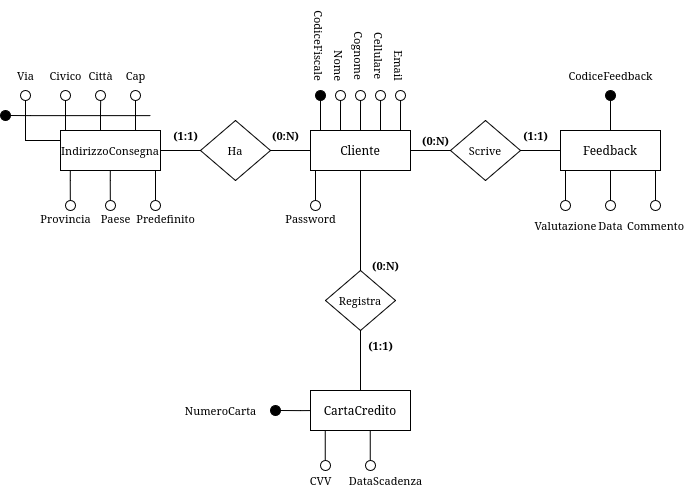
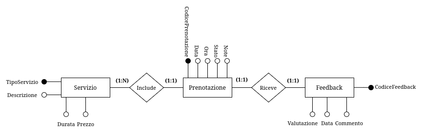
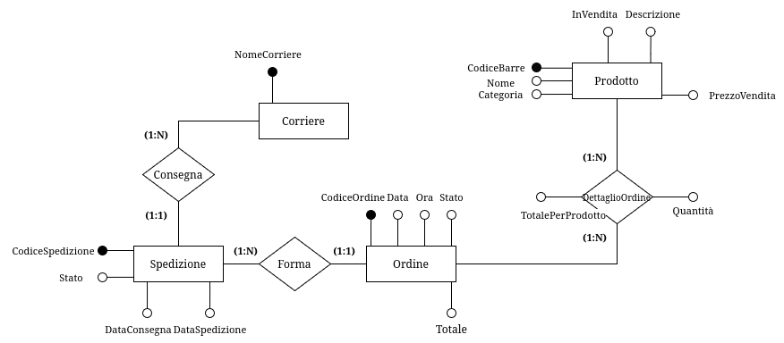

# Fase 2: Progettazione concettuale - TORVERBARBER

## Componenti del gruppo

| Nome           | Cognome   | Matricola | Mail                                          |
|----------------|-----------|-----------|-----------------------------------------------|
| Ionut Georgian | Zbirciog  | 0308984   | <ionutgeorgian.zbirciog@students.uniroma2.eu> |
| Francesco      | Cosciotti | 0323545   | <francesco.cosciotti@students.uniroma2.eu>    |
| Adriano        | Porzia    | 0327131   | <adriano.porzia@students.uniroma2.eu>         |

## Dominio Applicativo

L'applicazione **TORVERBARBER** mira a centralizzare le operazioni giornaliere di una catena di *barber shop*, facilitando la gestione per il personale e offrendo una piattaforma digitale intuitiva per i clienti.

---

## Obiettivi del Progetto

1. **Ottimizzare l'efficienza operativa**: garantire una gestione fluida delle prenotazioni, dei turni e delle vendite.
2. **Migliorare l’esperienza del cliente**: offrire strumenti digitali per prenotazioni, notifiche e personalizzazione dei servizi.
3. **Incrementare la fidelizzazione**: fornendo promozioni mirate e un’interfaccia che incentivi il ritorno dei clienti.
4. **Analisi strategiche**: fornire report dettagliati per migliorare le prestazioni aziendali.

---

## Raccolta dei Dati e Analisi dei Requisiti

### Analisi degli utenti

1. **Cliente**
    - L'applicazione è stata progettata per migliorare significativamente l'esperienza dei clienti, offrendo strumenti che semplificano l'accesso ai servizi e aumentano la fidelizzazione. Ogni cliente avrà la possibilità di creare un proprio profilo personale sulla piattaforma online. Durante la registrazione, verranno richiesti alcuni dati fondamentali come il nome utente, l’indirizzo email e il numero di cellulare. Questo profilo diventerà il punto di accesso principale per gestire tutte le funzionalità offerte dall’applicazione.

    - Tra le caratteristiche principali, c'è la possibilità di effettuare prenotazioni online in modo semplice e veloce. I clienti potranno scegliere il negozio più vicino, selezionare il barbiere preferito e definire i servizi desiderati. Inoltre, avranno sempre la possibilità di modificare o cancellare le prenotazioni in base alle loro esigenze.

    - Un altro elemento chiave è l'accesso allo storico dei servizi e degli acquisti. Questa funzionalità permette ai clienti di consultare i dettagli dei trattamenti ricevuti e dei prodotti acquistati in passato. Per quanto riguarda i prodotti, l’applicazione consente di effettuare ordini online per poi essere spediti all' utente.

    - Infine, i clienti avranno la possibilità di lasciare feedback e valutazioni sui servizi ricevuti. Questa funzionalità non solo permette loro di esprimere la propria opinione, ma aiuta anche il negozio a migliorare la qualità dei servizi offerti, rendendo il processo di miglioramento continuo un pilastro centrale dell’esperienza cliente.
2. **Dipendenti**
    L'applicazione offre strumenti dedicati allo staff, che è suddiviso in due categorie principali: dipendenti e manager. Ogni ruolo ha accesso a funzionalità personalizzate, progettate per ottimizzare le operazioni quotidiane.

    - I **barbieri** rappresentano il cuore operativo di ogni negozio. Attraverso l’applicazione, possono accedere facilmente al proprio profilo e visualizzare le prenotazioni che li riguardano. Hanno inoltre a disposizione un calendario aggiornato che consente loro di consultare i turni di lavoro, così da pianificare la giornata in modo efficiente. Inoltre, i barbieri possono registrare i servizi offerti ai clienti, che verranno automaticamente collegati al profilo del cliente per garantire uno storico dettagliato.

    - I **receptionist** svolgono un ruolo chiave nel mantenere il negozio operativo e nel supportare i clienti. Il loro compito principale è la gestione delle prenotazioni: grazie a un’interfaccia intuitiva, possono aggiungere, modificare o annullare appuntamenti in base alle esigenze del cliente o alle disponibilità dei barbieri. Sono anche il primo punto di contatto per i clienti che necessitano di assistenza, sia per questioni legate alle prenotazioni sia per problemi relativi agli acquisti. Infine, il receptionist monitora l’attività quotidiana del negozio, assicurandosi che tutto funzioni senza intoppi.

    - Ogni negozio è gestito da un **responsabile** che si occupa di coordinare le attività operative. Questo ruolo include la gestione dei turni dei barbieri, adattandoli alle necessità del negozio, e il controllo dell’inventario, verificando che le scorte siano sufficienti sia per la vendita sia per l’uso interno. Il responsabile si occupa anche delle comunicazioni con i fornitori, assicurando un flusso costante di materiali e prodotti. Infine, fornisce report regolari al manager di zona, così da mantenere una supervisione generale sull’andamento del negozio.

    - Il **manager** supervisiona un insieme di negozi all’interno di una determinata area geografica. Questo ruolo richiede una visione globale delle performance di ogni negozio, analizzando report e dati forniti dai responsabili. Il manager di zona lavora per risolvere eventuali problematiche e garantire che i negozi rispettino gli standard qualitativi della catena. Inoltre, ha la responsabilità di pianificare promozioni e strategie per incrementare le vendite e la soddisfazione dei clienti su scala regionale.

    - Infine, il **CEO** è responsabile della supervisione complessiva della catena di *barber shop*. Questo ruolo si concentra sull’analisi strategica dei dati provenienti da tutti i negozi, identificando tendenze e opportunità per migliorare le operazioni. Il CEO definisce gli obiettivi aziendali a lungo termine, pianifica l’espansione del marchio e gestisce le relazioni con partner e investitori, garantendo così la crescita e la sostenibilità dell’intera catena.

---

La catena di negozi **TORVERBARBER** adotta una struttura gerarchica in cui ogni negozio è gestito da un **manager**, che a sua volta riferisce al **responsabile di zona**. Quest'ultimo è in diretto contatto con il **CEO** e supervisiona più negozi in una stessa zona o città. Ogni ruolo all'interno dello staff ha responsabilità specifiche, con una scala retributiva definita e una progressione salariale basata sugli anni di servizio.

#### Ruoli e Responsabilità

- **Receptionist:** Prima figura di contatto per i clienti, si occupano di accoglienza, gestione delle prenotazioni e supporto amministrativo. La crescita salariale segue una costante stipendiale pari a $1.01$ moltiplicata per gli anni di servizio.

- **Barbiere:** Responsabili dei servizi offerti ai clienti (tagli, trattamenti barba, ecc.). Lo stipendio cresce con una costante stipendiale di $1.02$.

- **Manager del negozio:** Gestisce le operazioni quotidiane del negozio, come turni, inventario e fornitori. Lo stipendio è calcolato con una costante di $1.03$.

- **Responsabile di zona:** Supervisiona più negozi in una zona, collabora con i manager e mantiene il contatto diretto con il CEO. La costante stipendiale è $1.04$.

- **CEO:** Guida l'azienda, definendo la strategia e supervisionando l'intera struttura. Lo stipendio è basato su contratti specifici e bonus performance, senza una costante stipendiale.

---

### Glossario dei termini

|      **Entità**       |                                                        **Descrizione**                                                         |             **Sinonimi**              |
|:---------------------:|:------------------------------------------------------------------------------------------------------------------------------:|:-------------------------------------:|
|      **Negozio**      |     Punto vendita fisico appartenente alla catena di barberie, in cui si offrono servizi di taglio e prodotti in vendita.      |        Barberia, Punto Vendita        |
|    **Dipendente**     |                  Persona che lavora nella catena con ruoli specifici (barbiere, receptionist, manager, ecc.).                  |           Personale, Staff            |
|      **Cliente**      |  Persona che usufruisce dei servizi della catena, registrandosi nel sistema per prenotare appuntamenti o acquistare prodotti.  |          Utente, Consumatore          |
|  **CartaDiCredito**   |                  Strumento di pagamento registrato da un cliente per effettuare transazioni online o offline.                  |       Carta di debito, Bancomat       |
| **IndirizzoConsegna** |                     Luogo specifico indicato da un cliente per ricevere spedizioni di prodotti acquistati.                     | Indirizzo di spedizione, Destinazione |
|   **Prenotazione**    |    Richiesta di appuntamento effettuata da un cliente per uno o più servizi in un negozio specifico, a un orario definito.     |         Appuntamento, Booking         |
|      **Entrata**      |                       Registrazione delle somme ricevute da un negozio, derivanti da servizi e prodotti.                       |           Introito, Ricavo            |
|       **Turno**       |                        Fascia oraria assegnata ai dipendenti per svolgere le loro mansioni lavorative.                         |           Orario lavorativo           |
|     **Feedback**      |          Opinione del cliente relativa a un servizio o prodotto, che include una valutazione numerica e un commento.           |         Recensione, Opinione          |
|     **Prodotto**      |                         Oggetti disponibili per la vendita o l'uso interno nei servizi di un negozio.                          |         Articolo, Inventario          |
|      **Ordine**       |                 Richiesta di acquisto di prodotti da parte di un cliente, con ritiro in negozio o spedizione.                  |           Comanda, Acquisto           |
|    **Spedizione**     |                      Processo di consegna dei prodotti acquistati da un cliente a un indirizzo specifico.                      |          Consegna, Trasporto          |
|     **Corriere**      |                  Operatore incaricato della gestione e consegna dei prodotti acquistati online o in negozio.                   |       Trasportatore, Logistica        |
|       **Zona**        |                 Area geografica che comprende uno o più negozi ed è supervisionata da un responsabile di zona.                 |             Area, Regione             |
|      **Offerta**      |                 Promozione temporanea che prevede uno sconto su prodotti o servizi per incentivare le vendite.                 |          Sconto, Promozione           |
|       **Ruolo**       |                   Posizione lavorativa assegnata ai dipendenti, con responsabilità e retribuzione definiti.                    |          Posizione, Mansione          |
|     **Servizio**      | Prestazione professionale offerta ai clienti (es. taglio capelli, trattamento barba, ecc.), con specifiche di prezzo e durata. |        Prestazione, Operazione        |

---

### Vincoli

1. **Feedback**
   - **1.1** Ogni feedback deve essere univocamente associato a una **Prenotazione** completata.
   - **1.2** Un cliente può lasciare al massimo un solo feedback per ogni prenotazione effettuata.
   - **1.3** Il feedback deve includere un voto (es. da 1 a 5) e può includere un commento opzionale.

2. **Zona e Responsabile di Zona**
   - **2.1** Ogni zona deve essere associata a **uno e un solo responsabile di zona**.
   - **2.2** Un responsabile di zona può gestire esclusivamente una zona.
   - **2.3** Ogni negozio deve essere collegato a una **zona esistente** e non può appartenere a più di una zona.

3. **Staff e Turni**
   - **3.1** Ogni membro dello staff deve essere assegnato almeno a un **turno** per poter lavorare.
   - **3.2** I turni devono specificare un orario di **inizio** e di **fine**.

4. **Prenotazioni**
   - **6.1** Ogni prenotazione deve includere:
     - Un **cliente**.
     - Un **barbiere**.
     - Un **negozio**.
   - **6.2** Le prenotazioni devono essere effettuate per orari all'interno degli orari di apertura del negozio.
   - **6.3** Ogni prenotazione deve includere almeno un **servizio**.
   - **6.4** Lo stato di una prenotazione deve essere uno tra: *Confermata*, *Annullata* o *Completata*.
   - **6.8** La prenotazione rappresente il turno del cliente.

5. **Entrata**
   - **5.1** Ogni entrata deve avere:
     - Una **data**.
     - Un **importo positivo**.
     - Un **metodo di pagamento** (es. contanti, carta di credito, bonifico, ecc.).
   - **5.2** Le entrate devono essere associate a un **negozio specifico**.
   - **5.3** Le entrate possono provenire da:
     - Prenotazioni.
     - Vendite di prodotti.

6. **Inventario**
   - **6.1** Ogni negozio deve avere un inventario associato.
   - **6.2** La quantità di un prodotto nell'inventario non può essere negativa.
   - **6.3** Ogni prodotto deve appartenere a una **categoria** (es. shampoo, accessori).
   - **6.4** Ogni prodotto può essere di tipo:
     - *Interno* (solo per uso nei servizi).
     - *Vendita* (solo per vendita diretta).
     - *Entrambi* (uso interno e vendita).

7. **Offerte**
    - **7.1** Ogni offerta deve essere valida per un periodo di tempo specifico, con date di inizio e fine.
    - **7.2** Le offerte possono essere associate a uno o più negozi e/o prodotti specifici.
    - **7.3** Gli sconti devono essere applicabili solo ai prodotti inclusi nell'offerta.

8. **Ruoli**
    - **8.1** Ogni membro dello staff deve avere un **ruolo definito**, con mansioni specifiche.
    - **8.2** Ogni ruolo ha una scala salariale associata.

9. **Ordini**
    - **9.1** Gli ordini possono essere effettuati solo da clienti registrati.
    - **9.2** Ogni ordine deve includere almeno un prodotto disponibile nell'inventario.
    - **9.3** Gli ordini possono essere spediti tramite corrieri oppure il cliente può acquistare il prodotto andando nel negozio.
    - **9.4** Gli ordini devono riportare lo stato: *In Elaborazione*, *Spedito*, *Consegnato*, o *Annullato*.

10. **Relazioni Gerarchiche**
    - **13.1** Ogni negozio deve avere un **manager** assegnato.
    - **13.2** Ogni manager deve rispondere al **responsabile di zona** della sua area.
    - **13.3** I responsabili di zona rispondono al **CEO**, che supervisiona l'intera azienda.

---

### Glossario delle entità

|    **Entità**    |                                              **Descrizione**                                              |                                          **Attributi**                                           |                   **Relazioni Coinvolte**                   |
|:----------------:|:---------------------------------------------------------------------------------------------------------:|:------------------------------------------------------------------------------------------------:|:-----------------------------------------------------------:|
|   **Negozio**    |  Punto vendita fisico della catena di barberie, dove si offrono servizi di taglio e vendita di prodotti.  |                            **Id_Negozio**, Nome, Indirizzo, Telefono, Orario                             | Dipendente, Inventario, Offerta, Prenotazione, Zona, Ordine |
|  **Dipendente**  |       Persona che lavora nella catena, con ruoli specifici (barbiere, receptionist, manager, ecc.).       | **Matricola**, Nome, Cognome, DataAssunzione, DataNascita, Cellulare, Email, Password, Stipendio |             Ruolo, Negozio, Turno, Prenotazione             |
|   **Cliente**    |           Persona che utilizza i servizi o acquista prodotti, registrandosi tramite il sistema.           |                    **Id_Cliente**, Nome, Cognome, Cellulare, Email, Password                     |   Prenotazione, Ordine, Feedback, Indirizzo, CartaCredito   |
| **CartaCredito** |            Carta di credito registrata dal cliente per effettuare pagamenti online o offline.             |                   **Id_Carta**, Numero, Tipo, DataScadenza, CVV, Nome, Cognome                   |                           Cliente                           |
|  **IndirizzoConsegna**   |                Luogo specifico fornito dal cliente per la consegna di prodotti acquistati.                |                   **Id_Indirizzo**, Via, Città, Cap, Paese, Provincia, Civico, Predefinito                    |                           Cliente                           |
| **Prenotazione** |          Richiesta di appuntamento effettuata da un cliente per usufruire di uno o più servizi.           |                           **Id_Prenotazione**, Data, Ora, Stato, Note                            |   Cliente, Dipendente, Turno, Negozio, Feedback, Servizio   |
|   **Entrata**    |                    Registrazione dei ricavi generati da servizi o vendite di prodotti.                    |                **Id_Entrata**, Data, Importo, Tipo, MetodoPagamento, Descrizione                 |              Prenotazione, Inventario, Negozio              |
|    **Turno**     |                    Fascia oraria assegnata a un dipendente per lavorare in un negozio.                    |                              **Id_Turno**, OraInizio, OraFine, Data                              |                  Dipendente, Prenotazione                   |
|   **Feedback**   |     Valutazione data da un cliente, con voto numerico e commento, dopo aver usufruito di un servizio.     |                              **Id_Feedback**, Voto, Commento, Data                               |                        Prenotazione                         |
|   **Prodotto**   |               Articolo disponibile per la vendita o per l’uso durante i servizi nei negozi.               |            **Id_Prodotto**, Nome, PrezzoAcquisto, PrezzoVendita, Categoria, Vendibile            |      Negozio, DettaglioOrdine, Movimentazioni, Offerta      |
|    **Ordine**    | Acquisto di uno o più prodotti da parte di un cliente, con possibilità di spedizione o ritiro in negozio. |                             **Id_Ordine**, Data, Ora, Stato, Totale                              |            DettaglioOrdine, Cliente, Spedizione             |
|  **Spedizione**  |                        Operazione di consegna dei prodotti acquistati ai clienti.                         |                      **Id_Spedizione**, DataSpedizione, DataConsegna, Stato                      |                      Ordine, Corriere                       |
|   **Corriere**   |                Operatore incaricato del trasporto e della consegna di prodotti ai clienti.                |                                      **Id_Corriere**, Nome                                       |                         Spedizione                          |
|     **Zona**     |                   Area geografica gestita da un responsabile e comprendente più negozi.                   |                                        **Id_Zona**, Nome                                         |                     Dipendente, Negozio                     |
|   **Offerta**    |        Promozione temporanea o sconto applicato a prodotti o servizi per incrementare le vendite.         |                        **Id_Offerta**, Inizio, Fine, Sconto, Descrizione                         |                     Negozio, Inventario                     |
|    **Ruolo**     |          Posizione lavorativa associata a un dipendente, con specifiche mansioni e retribuzione.          |                               **Id_Ruolo**, Tipo, LivelloStipendio                               |                         Dipendente                          |
|   **Servizio**   |   Prestazione offerta ai clienti (es. taglio capelli, trattamento barba) con durata e prezzo definiti.    |                        **Id_Servizio**, Tipo, Prezzo, Durata, Descrizione                        |                        Prenotazione                         |

---

### Diagramma Entity-Relationship

#### Schema Scheletro

Sono state individuate le seguenti entità principali. Il *Dipendente* lavora in un *Negozio*, il *Negozio* gestisce le *Prenotazioni*, i *Clienti* effettuano le *Prenotazioni* ed effettuano gli *Ordini*.

{width="300" style="display: block; margin: 0 auto"}

#### Raffinamenti

##### Raffinazione entità **Negozio**

1. **Negozio - Zona**
   - **Relazione:** *Appartiene*  
   - **Cardinalità:** 1 a N (Un negozio appartiene a una sola zona; una zona può includere più negozi).  
   - **Descrizione:** Ogni negozio è situato in una zona geografica specifica, gestita da un responsabile di zona. La zona facilita il coordinamento strategico e operativo tra più negozi appartenenti alla stessa area.  
2. **Negozio - Prodotto**
   - **Relazione:** *Inventario*
   - **Cardinalità:** N a N
     - Ogni **negozio** può avere **più prodotti** nel suo inventario.
     - Ogni **prodotto** può essere presente in **più negozi**.
   - **Descrizione:** Ogni negozio dispone di un inventario in cui vengono tracciati i prodotti disponibili per la vendita. La relazione permette di gestire informazioni relative ai prodotti presenti nei vari negozi, come quantità disponibili, prezzi specifici per negozio o altre caratteristiche legate alla vendita.
3. **Negozio - Offerta**
   - **Relazione:** *Propone*  
   - **Cardinalità:** N a N (Un negozio può proporre più offerte; un'offerta può essere valida per più negozi).  
   - **Descrizione:** I negozi possono proporre promozioni o sconti specifici per attrarre clienti. Queste offerte possono essere limitate a un negozio o estese a più negozi, in base alle strategie aziendali.  
4. **Negozio - Entrata**
   - **Relazione:** *Genera*  
   - **Cardinalità:** 1 a N (Un negozio può registrare più entrate; ogni entrata è associata a un solo negozio).  
   - **Descrizione:** Ogni negozio genera entrate derivanti da servizi forniti e prodotti venduti. Questi dati sono tracciati per analizzare le performance economiche del negozio.
5. **Offerta - Prodotto**
   - **Relazione:** *Applica*
   - **Cardinalità:** N a N (Un'offertà può essere applicata a uno o più prodotti; ad un prodotto può essere applicata una o più offerte).
   - **Descrizione:** Le offerte applicano uno sconto ai prodotti.

{width="500" style="display: block; margin: 0 auto"}

---

##### Raffinazione entità **Dipendente**

1. **Dipendente - Turno**
   - **Relazione:** Assegnazione
   - **Cardinalità:** N a N (Un dipendente (barbiere, receptionist, manager) è assegnato a uno o più turni; Un turno è è assegnato a uno o più dipendenti (barbiere, receptionist, manager)).
   - **Descrizione:** I turni sono assegnati solamente ai barbieri, receptionist e ai manager del negozio, mentre il responsabile di zona e il CEO non hanno turni.
2. **Dipendente - Zona**
   - **Relazione:** Assegnazione
   - **Cardinalità:** 1 a 1 (Un dipendente (responsabile di zona) è assegnato ad una zona; Una zona è assegnata ad un unico dipendente (responsabile di zona)).
3. **Dipendente - Ruolo**
   - **Relazione:** Svolge
   - **Cardinalità:** 1 a N (Un dipendente svolge un'unico ruolo; un ruolo è svolto da più dipendente).

{width="500" style="display: block; margin: 0 auto"}

---

##### Raffinazione entità **Cliente**

1. **Cliente - Feedback**
   - **Relazione:** Scrive
   - **Cardinalità:** 1 a N (Un cliente può scrivere una o più recensioni; una recensione è scritta da un unico cliente).
2. **Cliente - IndirizzoConsegna**
   - **Relazione:** Ha
   - **Cardinalità:** 1 a N (Un cliente può avere uno o più indirizzi di consegna; un indirizzo di consegna è di un unico cliente).
3. **Cliente - CartaCredito**
   - **Relazione:** Registra
   - **Cardinalità:** 1 a N (un cliente può registrare uno o più carte di credito; una carta di credito è di un unico cliente).

{width="500" style="display: block; margin: 0 auto"}

---

##### Raffinazione entità **Prenotazione**

1. **Prenotazione - Servizio**
   - **Relazione:** Include
   - **Cardinalità:** 1 a N (Una prenotazione include un unico servizio (capelli, barba, capelli e barba etc...); Un servizio è incluso in più prenotazioni).
2. **Prenotazione - Feedback**
   - **Relazione:** Riceve
   - **Cardinalità:** 1 a 1 (Una prenotazione rivece un unica recensione; Una recensione è riferita ad una sola prenotazione).

{width="500" style="display: block; margin: 0 auto"}

---

##### Raffinazione entità **Ordine**

1. **Ordine - Prodotto**
   - **Relazione:** DettaglioOrdine
   - **Cardinalità:** N a N (Un ordine contiene uno o più prodotti; un prodotto è presente in uno o più ordini).
   - **Descrizione:** La relazione *DettaglioOrdine* rappresenta il *carrello* del cliente che effettua l'ordine, infatti in questa relazione ci sono gli attributi: `totalePerProdotto` e `Quantità`.
2. **Ordine - Spedizione**
   - **Relazione:** Forma
   - **Cardinalità:** 1 a N (Un ordine forma una spedizione; Una spedizione può essere formata da più ordini)
3. **Spedizione - Corriere**
   - **Relazione:** Consegna
   - **Cardinalità:** 1 a N (Una spedizione è consegnata da un unico corriere; un corrire consegna una o più spedizioni).

{width="500" style="display: block; margin: 0 auto"}

### Diagramma E-R Finale

Dopo aver rifinito le entità invidutate nello schema scheletro, otteniamo lo schema E-R finale.

{width="800" style="display: block; margin: 0 auto"}
