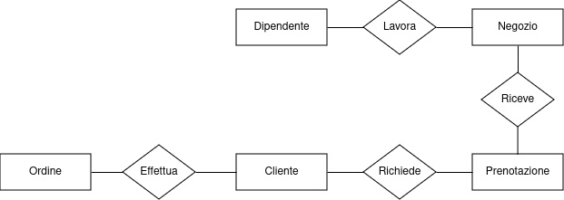
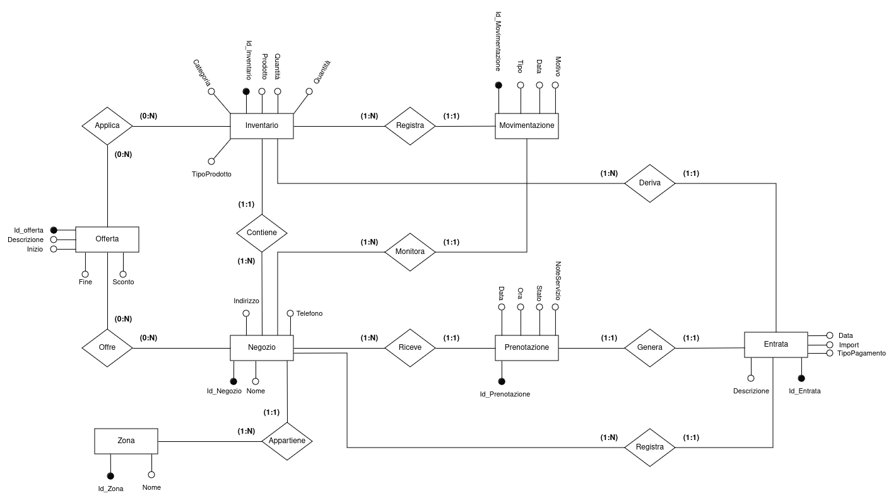

# Fase 2: Progettazione Concettuale - TORVERBARBER

## Dominio Applicativo

L'applicazione **TORVERBARBER** mira a centralizzare le operazioni giornaliere di una catena di *barber shop*, facilitando la gestione per il personale e offrendo una piattaforma digitale intuitiva per i clienti.

---

## Obiettivi del Progetto

1. **Ottimizzare l'efficienza operativa**: garantire una gestione fluida delle prenotazioni, dei turni e delle vendite.
2. **Migliorare l’esperienza del cliente**: offrire strumenti digitali per prenotazioni, notifiche e personalizzazione dei servizi.
3. **Incrementare la fidelizzazione**: fornendo promozioni mirate e un’interfaccia che incentivi il ritorno dei clienti.
4. **Analisi strategiche**: fornire report dettagliati per migliorare le prestazioni aziendali.

---

## Raccolta dei Dati e Analisi dei Requisiti

### Analisi degli utenti

1. **Cliente**
    - L'applicazione è stata progettata per migliorare significativamente l'esperienza dei clienti, offrendo strumenti che semplificano l'accesso ai servizi e aumentano la fidelizzazione. Ogni cliente avrà la possibilità di creare un proprio profilo personale sulla piattaforma online. Durante la registrazione, verranno richiesti alcuni dati fondamentali come il nome utente, l’indirizzo email e il numero di cellulare. Questo profilo diventerà il punto di accesso principale per gestire tutte le funzionalità offerte dall’applicazione.

    - Tra le caratteristiche principali, c'è la possibilità di effettuare prenotazioni online in modo semplice e veloce. I clienti potranno scegliere il negozio più vicino, selezionare il barbiere preferito e definire i servizi desiderati. Inoltre, avranno sempre la possibilità di modificare o cancellare le prenotazioni in base alle loro esigenze.

    - Un altro elemento chiave è l'accesso allo storico dei servizi e degli acquisti. Questa funzionalità permette ai clienti di consultare i dettagli dei trattamenti ricevuti e dei prodotti acquistati in passato. Per quanto riguarda i prodotti, l’applicazione consente di effettuare ordini online che potranno essere ritirati comodamente nel negozio prescelto.

    - L’applicazione include anche un sistema di notifiche personalizzate. I clienti riceveranno promozioni esclusive e offerte dedicate, con l'obiettivo di incentivare il loro ritorno. Ad esempio, dopo aver completato 10 tagli, il cliente potrà ricevere un taglio gratuito come premio per la sua fedeltà.

    - Infine, i clienti avranno la possibilità di lasciare feedback e valutazioni sui servizi ricevuti. Questa funzionalità non solo permette loro di esprimere la propria opinione, ma aiuta anche il negozio a migliorare la qualità dei servizi offerti, rendendo il processo di miglioramento continuo un pilastro centrale dell’esperienza cliente.
2. **Dipendenti**
    L'applicazione offre strumenti dedicati allo staff, che è suddiviso in due categorie principali: dipendenti e manager. Ogni ruolo ha accesso a funzionalità personalizzate, progettate per ottimizzare le operazioni quotidiane.

    - I **barbieri** rappresentano il cuore operativo di ogni negozio. Attraverso l’applicazione, possono accedere facilmente al proprio profilo e visualizzare le prenotazioni che li riguardano. Hanno inoltre a disposizione un calendario aggiornato che consente loro di consultare i turni di lavoro, così da pianificare la giornata in modo efficiente. Inoltre, i barbieri possono registrare i servizi offerti ai clienti, che verranno automaticamente collegati al profilo del cliente per garantire uno storico dettagliato.

    - I **receptionist** svolgono un ruolo chiave nel mantenere il negozio operativo e nel supportare i clienti. Il loro compito principale è la gestione delle prenotazioni: grazie a un’interfaccia intuitiva, possono aggiungere, modificare o annullare appuntamenti in base alle esigenze del cliente o alle disponibilità dei barbieri. Sono anche il primo punto di contatto per i clienti che necessitano di assistenza, sia per questioni legate alle prenotazioni sia per problemi relativi agli acquisti. Infine, il receptionist monitora l’attività quotidiana del negozio, assicurandosi che tutto funzioni senza intoppi.

    - Ogni negozio è gestito da un **responsabile** che si occupa di coordinare le attività operative. Questo ruolo include la gestione dei turni dei barbieri, adattandoli alle necessità del negozio, e il controllo dell’inventario, verificando che le scorte siano sufficienti sia per la vendita sia per l’uso interno. Il responsabile si occupa anche delle comunicazioni con i fornitori, assicurando un flusso costante di materiali e prodotti. Infine, fornisce report regolari al manager di zona, così da mantenere una supervisione generale sull’andamento del negozio.

    - Il **manager** supervisiona un insieme di negozi all’interno di una determinata area geografica. Questo ruolo richiede una visione globale delle performance di ogni negozio, analizzando report e dati forniti dai responsabili. Il manager di zona lavora per risolvere eventuali problematiche e garantire che i negozi rispettino gli standard qualitativi della catena. Inoltre, ha la responsabilità di pianificare promozioni e strategie per incrementare le vendite e la soddisfazione dei clienti su scala regionale.

    - Infine, il **CEO** è responsabile della supervisione complessiva della catena di *barber shop*. Questo ruolo si concentra sull’analisi strategica dei dati provenienti da tutti i negozi, identificando tendenze e opportunità per migliorare le operazioni. Il CEO definisce gli obiettivi aziendali a lungo termine, pianifica l’espansione del marchio e gestisce le relazioni con partner e investitori, garantendo così la crescita e la sostenibilità dell’intera catena.

---

La catena di negozi **TORVERBARBER** adotta una struttura gerarchica in cui ogni negozio è gestito da un **manager**, che a sua volta riferisce al **responsabile di zona**. Quest'ultimo è in diretto contatto con il **CEO** e supervisiona più negozi in una stessa zona o città. Ogni ruolo all'interno dello staff ha responsabilità specifiche, con una scala retributiva definita e una progressione salariale basata sugli anni di servizio.

#### Ruoli e Responsabilità

- **Receptionist:** Prima figura di contatto per i clienti, si occupano di accoglienza, gestione delle prenotazioni e supporto amministrativo. La crescita salariale segue una costante stipendiale pari a $1.01$ moltiplicata per gli anni di servizio.

- **Barbiere:** Responsabili dei servizi offerti ai clienti (tagli, trattamenti barba, ecc.). Lo stipendio cresce con una costante stipendiale di $1.02$.

- **Manager del negozio:** Gestisce le operazioni quotidiane del negozio, come turni, inventario e fornitori. Lo stipendio è calcolato con una costante di $1.03$.

- **Responsabile di zona:** Supervisiona più negozi in una zona, collabora con i manager e mantiene il contatto diretto con il CEO. La costante stipendiale è $1.04$.

- **CEO:** Guida l'azienda, definendo la strategia e supervisionando l'intera struttura. Lo stipendio è basato su contratti specifici e bonus performance, senza una costante stipendiale.

---

### Glossario dei termini

|    **Entità**    |                                                            **Descrizione**                                                            |      **Sinonimi**       |
|:----------------:|:-------------------------------------------------------------------------------------------------------------------------------------:|:-----------------------:|
|   **Negozio**    |         Punto vendita fisico appartenente alla catena di barberie, in cui si offrono servizi di taglio e vendita di prodotti          | Barberia, Punto Vendita |
|    **Dipendente**     |             Dipendenti che lavorano all'interno della catena, con ruoli specifici (barbiere, receptionist, manager, ecc.)             |  Staff, Personale  |
|   **Cliente**    |         Utente che usufruisce dei servizi della catena, registrandosi tramite il sistema per prenotare o acquistare prodotti          |   Utente, Consumatore   |
| **Prenotazione** |        Richiesta di appuntamento effettuata dal cliente per uno o più servizi in un negozio specifico, a un orario determinato        |  Appuntamento, Booking  |
|    **Turno**     |                          Orario lavorativo assegnato ai membri dello staff per svolgere le proprie mansioni                           |    Orario Lavorativo    |
|   **Feedback**   |                 Valutazione lasciata dal cliente dopo aver usufruito di un servizio. Comprende un voto e un commento                  |  Recensione, Opinione   |
|  **Inventario**  |                  Lista dei prodotti disponibili in un negozio, sia per la vendita sia per l'uso interno nei servizi                   |    Magazzino, Stock     |
|    **Ordine**    |                             Acquisto di uno o più prodotti effettuato dal cliente, da ritirare in negozio                             |    Acquisto, Comanda    |
|     **Zona**     |                        Area geografica supervisionata da un responsabile di zona, che include uno o più negozi                        |      Area, Regione      |
|   **Offerta**    |                                Promozione temporanea o sconto su prodotti o servizi offerti ai clienti                                |   Sconto, Promozione    |
|    **Ruolo**     | Posizione lavorativa all'interno dello staff (es. Barbiere Junior, Manager, Receptionist), associata a specifiche mansioni e stipendi |   Posizione, Mansione   |
|   **Servizio**   |        Tipologia di prestazione offerta ai clienti (es. taglio capelli, trattamento barba, ecc.), con prezzi e durate definite        | Prestazione, Operazione |

---

### Vincoli

1. **Feedback**
    1.1 Il feedback è legato esclusivamente al ruolo di Barbiere.
    1.2 Ogni feedback deve essere associato a una prenotazione specifica.
    1.3 Un cliente può lasciare un solo feedback per ogni prenotazione effettuata.
2. **Zona e Responsabile di Zona**
    2.1 Ogni zona è associata a uno e un solo responsabile di zona.
    2.2 Un responsabile di zona può gestire una sola zona.
    2.3 Ogni negozio deve appartenere a una zona esistente.
3. **Preferenze del Cliente**
    3.1 Un cliente può esprimere preferenze per uno o più barbieri di un negozio.
    3.2 Le preferenze devono essere specifiche per un negozio, poiché i barbieri non lavorano in più negozi.
4. **Barbiere e Livello di Esperienza**
    4.1 Ogni barbiere ha un livello di esperienza assegnato (Junior, Senior, Master).
    4.2 Ogni servizio è associato a un livello minimo di esperienza richiesto.
    4.3 I barbieri possono eseguire solo servizi compatibili con il loro livello di esperienza.
5. **Staff e Turni**
    5.1 Ogni membro dello staff deve essere assegnato a un turno per poter lavorare.
    5.2 Un turno deve specificare un orario di inizio e fine e non può sovrapporsi per lo stesso membro dello staff.
    5.3 Ogni turno deve essere associato a un negozio specifico.
6. **Prenotazioni**
    6.1 Ogni prenotazione deve essere associata a un cliente, un barbiere, e un negozio.
    6.2 Le prenotazioni non possono essere effettuate per orari al di fuori degli orari di apertura del negozio.
    6.3 Una prenotazione deve includere almeno un servizio.
    6.4 Lo stato di una prenotazione deve essere definito come uno tra: Confermata, Annullata, Completata.
7. **Entrata**
    7.1 Ogni entrata deve avere una data e un importo.
    7.2 L'importo non può essere negativo.
    7.3 Ogni entrata deve essere legata a un negozio.
8. **Inventario**
    7.1 Ogni negozio deve avere un inventario associato.
    7.2 Le quantità dei prodotti in inventario non possono essere negative.
    7.3 Ogni prodotto deve appartenere a una categoria (es. shampoo, accessori, ecc.).
    7.4 Ogni prodotto può essere di 3 tipi: Interno, Vendita, Entrambi
9. **Movimentazioni**
    8.1 Ogni operazione avvenuta nell'inventario può essere di tipo: Acquisto, Reso, Vendita, Fornire
10. **Offerte**
    8.1 Ogni offerta deve essere valida per un periodo di tempo specificato.
    8.2 Le offerte possono essere associate a uno o più negozi.
11. **Ruoli**
    9.1 Ogni membro dello staff deve avere un ruolo definito (es. Barbiere, Receptionist, Manager, ecc.).
    9.2 Ogni ruolo ha una scala salariale associata, con incrementi basati sugli anni di servizio.
12. **Ordini**
    10.1 Gli ordini possono essere effettuati solo dai clienti registrati.
    10.2 Gli ordini devono includere almeno un prodotto disponibile nell'inventario.
    10.3 Gli ordini possono essere ritirati solo nel negozio associato.
13. **Relazioni Gerarchiche**
    11.1 Ogni negozio deve avere un manager assegnato.
    11.2 Ogni manager deve rispondere al responsabile di zona per la propria area.
    11.3 Il CEO supervisiona i responsabili di zona, mantenendo una visione globale dell'azienda.

---

### Glossario delle entità

|     Entità     |                                                              Descrizione                                                              |                                            Attributi                                             |                       Relazioni Coinvolte                        |
|:--------------:|:-------------------------------------------------------------------------------------------------------------------------------------:|:------------------------------------------------------------------------------------------------:|:----------------------------------------------------------------:|
|    Negozio     |         Punto vendita fisico appartenente alla catena di barberie, in cui si offrono servizi di taglio e vendita di prodotti          |                            **Negozio_Id**, Nome, Indirizzo, Telefono                             |  Dipendente, Inventario, Offerta, Prenotazione, Movimentazioni, Zona, Ordine   |
|   Dipendente   |             Dipendenti che lavorano all'interno della catena, con ruoli specifici (barbiere, receptionist, manager, ecc.)             | **Matricola**, Nome, Cognome, DataAssunzione, DataNascita, Cellulare, Email, Password, Stipendio | Ruolo, Negozio, Feedback, Turno, Prenotazione, Cliente, Servizio |
|    Cliente     |         Utente che usufruisce dei servizi della catena, registrandosi tramite il sistema per prenotare o acquistare prodotti          |                    **Cliente_Id**, Nome, Cognome, Cellulare, Email, Password                     |       Prenotazione, Ordine, Feedback, Offerta, Dipendente        |
|  Prenotazione  |        Richiesta di appuntamento effettuata dal cliente per uno o più servizi in un negozio specifico, a un orario determinato        |                       **Prenotazione_Id**, Data, Ora, Stato, NoteServizio                        |          Cliente, Dipendente, Turno, Negozio, Feedback           |
|    Entrata     |                              Storico di tutte le entrate, sia dalla vendità dei prodotti che da servizi                               |                **Entrata_Id**, Data, Importo, Tipo, MetodoPagamento, Descrizione                 |                 Prenotazione, Inventario, Negozio                  |
|     Turno      |                          Orario lavorativo assegnato ai membri dello staff per svolgere le proprie mansione                           |                              **Turno_Id**, OraInizio, OraFine, Data                              |                     Dipendente, Prenotazione                     |
|    Feedback    |                 Valutazione lasciata dal cliente dopo aver usufruito di un servizio. Comprende un voto e un commento                  |                              **Feedback_Id**, Voto, Commento, Data                               |                           Prenotazione                           |
|   Inventario   |                  Lista dei prodotti disponibili in un negozio, sia per la vendita sia per l'uso interno nei servizi.                  |   **Inventario_Id**, Prodotto, Quantità, PrezzoAcquisto, PrezzoVendità Categoria, TipoProdotto   |             Negozio, Ordine, Movimentazioni, Offerta             |
| Movimentazioni |                                   Storico delle operazioni avvenute in un inventario di un negozio.                                   |                       **Movimentazioni_Id**, Tipo, Data, Quantità, Motivo                        |                       Negozio, Inventario                        |
|     Ordine     |                             Acquisto di uno o più prodotti effettuato dal cliente, da ritirare in negozio                             |                                  **Ordine_Id**, Data, Ora Stato                                  |                   Cliente, Negozio, Inventario                   |
|      Zona      |                        Area geografica supervisionata da un responsabile di zona, che include uno o più negozi                        |                                        **Zona_Id**, Nome                                         |                       Dipendente, Negozio                        |
|    Offerta     |                                Promozione temporanea o sconto su prodotti o servizi offerti ai clienti                                |                        **Offerta_Id**, Inizio, Fine, Sconto, Descrizione                         |                       Negozio, Inventario                        |
|     Ruolo      | Posizione lavorativa all'interno dello staff (es. Barbiere Junior, Manager, Receptionist), associata a specifiche mansioni e stipendi |                               **Ruolo_Id**, Tipo, LivelloStipendio                               |                            Dipendente                            |
|    Servizio    |        Tipologia di prestazione offerta ai clienti (es. taglio capelli, trattamento barba, ecc.), con prezzi e durate definite        |                        **Servizio_Id**, Tipo, Prezzo, Durata, Descrizione                        |                     Prenotazione, Dipendente                     |

---

### Diagramma Entity-Relationship

#### Schema Scheletro

Sono state individuate le seguenti entità principali. Lo *Staff* lavora in un *Negozio*, il *Negozio* gestisce le *Prenotazioni* e i *Clienti* effettuano le *Prenotazioni*

{width="300" style="display: block; margin: 0 auto"}

#### Raffinamenti

##### Inziamo con raffinare l'entità **Negozio**

1. **Negozio - Dipendente**
   - **Relazione:** *Gestisce*  
   - **Cardinalità:** 1 a N (Un negozio può avere più dipendenti; ogni dipendente appartiene a un solo negozio).  
   - **Descrizione:** Ogni negozio è associato a un team di dipendenti che comprende barbieri, receptionist e il manager del negozio. Questi dipendenti operano esclusivamente nel negozio di appartenenza e svolgono le proprie mansioni in base al ruolo assegnato.
2. **Negozio - Prenotazione**
   - **Relazione:** *Riceve*  
   - **Cardinalità:** 1 a N (Un negozio può ricevere più prenotazioni; ogni prenotazione è associata a un solo negozio).  
   - **Descrizione:** I clienti effettuano prenotazioni presso un negozio specifico per usufruire di servizi come taglio di capelli o trattamenti. Ogni prenotazione include dettagli come data, orario e il dipendente selezionato per il servizio.
3. **Negozio - Zona**
   - **Relazione:** *Appartiene a*  
   - **Cardinalità:** N a 1 (Un negozio appartiene a una sola zona; una zona può includere più negozi).  
   - **Descrizione:** Ogni negozio è situato in una zona geografica specifica, gestita da un responsabile di zona. La zona facilita il coordinamento strategico e operativo tra più negozi appartenenti alla stessa area.  
4. **Negozio - Inventario**
   - **Relazione:** *Contiene*  
   - **Cardinalità:** 1 a 1 (Ogni negozio ha un inventario unico; l'inventario appartiene a un solo negozio).  
   - **Descrizione:** Ogni negozio dispone di un inventario in cui sono tracciati i prodotti disponibili per la vendita o l'uso interno. L'inventario è continuamente aggiornato attraverso operazioni come acquisti, resi e vendite.
5. **Negozio - Offerta**
   - **Relazione:** *Propone*  
   - **Cardinalità:** 1 a N (Un negozio può proporre più offerte; un’offerta può essere valida per più negozi).  
   - **Descrizione:** I negozi possono proporre promozioni o sconti specifici per attrarre clienti. Queste offerte possono essere limitate a un negozio o estese a più negozi, in base alle strategie aziendali.  
6. **Negozio - Ordine**
   - **Relazione:** *Evade*  
   - **Cardinalità:** 1 a N (Un negozio può evadere più ordini; un ordine è associato a un solo negozio).  
   - **Descrizione:** I clienti possono acquistare prodotti direttamente presso un negozio o ordinare online, scegliendo il negozio in cui ritirare gli articoli acquistati.
7. **Negozio - Entrata**
   - **Relazione:** *Genera*  
   - **Cardinalità:** 1 a N (Un negozio può registrare più entrate; ogni entrata è associata a un solo negozio).  
   - **Descrizione:** Ogni negozio genera entrate derivanti da servizi forniti e prodotti venduti. Questi dati sono tracciati per analizzare le performance economiche del negozio.
8. **Negozio - Movimentazioni**
   - **Relazione:** *Registra*  
   - **Cardinalità:** 1 a N (Un negozio può registrare più movimentazioni; ogni movimentazione è associata a un solo negozio).  
   - **Descrizione:** Le movimentazioni dell'inventario, come acquisti di prodotti, resi o vendite, sono registrate per tenere traccia delle variazioni delle scorte in un negozio.  

{width="500" style="display: block; margin: 0 auto"}
