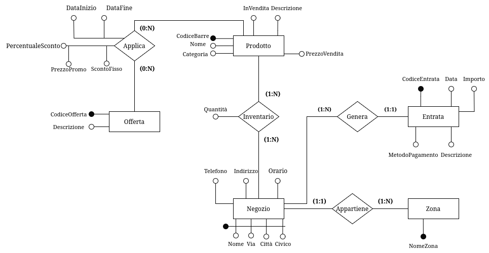

# Fase 2: Progettazione Concettuale - TORVERBARBER

## Dominio Applicativo

L'applicazione **TORVERBARBER** mira a centralizzare le operazioni giornaliere di una catena di *barber shop*, facilitando la gestione per il personale e offrendo una piattaforma digitale intuitiva per i clienti.

---

## Obiettivi del Progetto

1. **Ottimizzare l'efficienza operativa**: garantire una gestione fluida delle prenotazioni, dei turni e delle vendite.
2. **Migliorare l’esperienza del cliente**: offrire strumenti digitali per prenotazioni, notifiche e personalizzazione dei servizi.
3. **Incrementare la fidelizzazione**: fornendo promozioni mirate e un’interfaccia che incentivi il ritorno dei clienti.
4. **Analisi strategiche**: fornire report dettagliati per migliorare le prestazioni aziendali.

---

## Raccolta dei Dati e Analisi dei Requisiti

### Analisi degli utenti

1. **Cliente**
    - L'applicazione è stata progettata per migliorare significativamente l'esperienza dei clienti, offrendo strumenti che semplificano l'accesso ai servizi e aumentano la fidelizzazione. Ogni cliente avrà la possibilità di creare un proprio profilo personale sulla piattaforma online. Durante la registrazione, verranno richiesti alcuni dati fondamentali come il nome utente, l’indirizzo email e il numero di cellulare. Questo profilo diventerà il punto di accesso principale per gestire tutte le funzionalità offerte dall’applicazione.

    - Tra le caratteristiche principali, c'è la possibilità di effettuare prenotazioni online in modo semplice e veloce. I clienti potranno scegliere il negozio più vicino, selezionare il barbiere preferito e definire i servizi desiderati. Inoltre, avranno sempre la possibilità di modificare o cancellare le prenotazioni in base alle loro esigenze.

    - Un altro elemento chiave è l'accesso allo storico dei servizi e degli acquisti. Questa funzionalità permette ai clienti di consultare i dettagli dei trattamenti ricevuti e dei prodotti acquistati in passato. Per quanto riguarda i prodotti, l’applicazione consente di effettuare ordini online per poi essere spediti all' utente.

    - L’applicazione include anche un sistema di notifiche personalizzate. I clienti riceveranno promozioni esclusive e offerte dedicate, con l'obiettivo di incentivare il loro ritorno. Ad esempio, dopo aver completato 10 tagli, il cliente potrà ricevere un taglio gratuito come premio per la sua fedeltà.

    - Infine, i clienti avranno la possibilità di lasciare feedback e valutazioni sui servizi ricevuti. Questa funzionalità non solo permette loro di esprimere la propria opinione, ma aiuta anche il negozio a migliorare la qualità dei servizi offerti, rendendo il processo di miglioramento continuo un pilastro centrale dell’esperienza cliente.
2. **Dipendenti**
    L'applicazione offre strumenti dedicati allo staff, che è suddiviso in due categorie principali: dipendenti e manager. Ogni ruolo ha accesso a funzionalità personalizzate, progettate per ottimizzare le operazioni quotidiane.

    - I **barbieri** rappresentano il cuore operativo di ogni negozio. Attraverso l’applicazione, possono accedere facilmente al proprio profilo e visualizzare le prenotazioni che li riguardano. Hanno inoltre a disposizione un calendario aggiornato che consente loro di consultare i turni di lavoro, così da pianificare la giornata in modo efficiente. Inoltre, i barbieri possono registrare i servizi offerti ai clienti, che verranno automaticamente collegati al profilo del cliente per garantire uno storico dettagliato.

    - I **receptionist** svolgono un ruolo chiave nel mantenere il negozio operativo e nel supportare i clienti. Il loro compito principale è la gestione delle prenotazioni: grazie a un’interfaccia intuitiva, possono aggiungere, modificare o annullare appuntamenti in base alle esigenze del cliente o alle disponibilità dei barbieri. Sono anche il primo punto di contatto per i clienti che necessitano di assistenza, sia per questioni legate alle prenotazioni sia per problemi relativi agli acquisti. Infine, il receptionist monitora l’attività quotidiana del negozio, assicurandosi che tutto funzioni senza intoppi.

    - Ogni negozio è gestito da un **responsabile** che si occupa di coordinare le attività operative. Questo ruolo include la gestione dei turni dei barbieri, adattandoli alle necessità del negozio, e il controllo dell’inventario, verificando che le scorte siano sufficienti sia per la vendita sia per l’uso interno. Il responsabile si occupa anche delle comunicazioni con i fornitori, assicurando un flusso costante di materiali e prodotti. Infine, fornisce report regolari al manager di zona, così da mantenere una supervisione generale sull’andamento del negozio.

    - Il **manager** supervisiona un insieme di negozi all’interno di una determinata area geografica. Questo ruolo richiede una visione globale delle performance di ogni negozio, analizzando report e dati forniti dai responsabili. Il manager di zona lavora per risolvere eventuali problematiche e garantire che i negozi rispettino gli standard qualitativi della catena. Inoltre, ha la responsabilità di pianificare promozioni e strategie per incrementare le vendite e la soddisfazione dei clienti su scala regionale.

    - Infine, il **CEO** è responsabile della supervisione complessiva della catena di *barber shop*. Questo ruolo si concentra sull’analisi strategica dei dati provenienti da tutti i negozi, identificando tendenze e opportunità per migliorare le operazioni. Il CEO definisce gli obiettivi aziendali a lungo termine, pianifica l’espansione del marchio e gestisce le relazioni con partner e investitori, garantendo così la crescita e la sostenibilità dell’intera catena.

---

La catena di negozi **TORVERBARBER** adotta una struttura gerarchica in cui ogni negozio è gestito da un **manager**, che a sua volta riferisce al **responsabile di zona**. Quest'ultimo è in diretto contatto con il **CEO** e supervisiona più negozi in una stessa zona o città. Ogni ruolo all'interno dello staff ha responsabilità specifiche, con una scala retributiva definita e una progressione salariale basata sugli anni di servizio.

#### Ruoli e Responsabilità

- **Receptionist:** Prima figura di contatto per i clienti, si occupano di accoglienza, gestione delle prenotazioni e supporto amministrativo. La crescita salariale segue una costante stipendiale pari a $1.01$ moltiplicata per gli anni di servizio.

- **Barbiere:** Responsabili dei servizi offerti ai clienti (tagli, trattamenti barba, ecc.). Lo stipendio cresce con una costante stipendiale di $1.02$.

- **Manager del negozio:** Gestisce le operazioni quotidiane del negozio, come turni, inventario e fornitori. Lo stipendio è calcolato con una costante di $1.03$.

- **Responsabile di zona:** Supervisiona più negozi in una zona, collabora con i manager e mantiene il contatto diretto con il CEO. La costante stipendiale è $1.04$.

- **CEO:** Guida l'azienda, definendo la strategia e supervisionando l'intera struttura. Lo stipendio è basato su contratti specifici e bonus performance, senza una costante stipendiale.

---

### Glossario dei termini

### Glossario dei termini (completo)

### Glossario dei termini aggiornato

|     **Entità**      |                                                            **Descrizione**                                                            |         **Sinonimi**         |
|:-------------------:|:-------------------------------------------------------------------------------------------------------------------------------------:|:----------------------------:|
|     **Negozio**     |         Punto vendita fisico appartenente alla catena di barberie, in cui si offrono servizi di taglio e vendita di prodotti          |   Barberia, Punto Vendita    |
|   **Dipendente**    |             Dipendenti che lavorano all'interno della catena, con ruoli specifici (barbiere, receptionist, manager, ecc.)             |       Staff, Personale       |
|     **Cliente**     |         Utente che usufruisce dei servizi della catena, registrandosi tramite il sistema per prenotare o acquistare prodotti          |     Utente, Consumatore      |
|  **CartaCredito**   |                    Dati di una carta di credito associata a un cliente per completare i pagamenti online o offline                    |  Carta, Metodo di Pagamento  |
|    **Indirizzo**    |                               Indirizzi utilizzati dai clienti per le spedizioni dei prodotti ordinati                                |    Destinazione, Località    |
|  **Prenotazione**   |        Richiesta di appuntamento effettuata dal cliente per uno o più servizi in un negozio specifico, a un orario determinato        |    Appuntamento, Booking     |
|      **Turno**      |                          Orario lavorativo assegnato ai membri dello staff per svolgere le proprie mansioni                           |      Orario Lavorativo       |
|    **Feedback**     |               Valutazione lasciata dal cliente dopo aver usufruito di un servizio, che comprende un voto e un commento                |     Recensione, Opinione     |
|   **Inventario**    |                  Lista dei prodotti disponibili in un negozio, sia per la vendita sia per l'uso interno nei servizi                   |       Magazzino, Stock       |
|     **Ordine**      |                                         Acquisto di uno o più prodotti effettuato dal cliente                                         |      Acquisto, Comanda       |
| **DettaglioOrdine** |                  Elementi specifici di un ordine, che includono i prodotti acquistati, le quantità e i prezzi totali                  | Riga Ordine, Articolo Ordine |
|     **Entrata**     |             Movimento economico registrato per incassi legati a prenotazioni, vendite o altri flussi di denaro in entrata             |    Transazione, Introito     |
| **Movimentazione**  |                     Storico di operazioni su un inventario, come aggiunte, rimozioni o trasferimenti di prodotti                      |      Registro Magazzino      |
|   **Spedizione**    |                                       Operazioni di consegna dei prodotti ordinati dai clienti.                                       |     Consegne, Trasporti      |
|    **Corriere**     |                         Gestori delle consegne dei prodotti acquistati online o tramite punti vendita fisici                          |    Vettori, Trasportatori    |
|      **Zona**       |                 Area geografica supervisionata da un responsabile di zona, che include uno o più negozi della catena                  |        Area, Regione         |
|     **Offerta**     |                                Promozione temporanea o sconto su prodotti o servizi offerti ai clienti                                |      Sconto, Promozione      |
|      **Ruolo**      | Posizione lavorativa all'interno dello staff (es. Barbiere Junior, Manager, Receptionist), associata a specifiche mansioni e stipendi |     Posizione, Mansione      |
|    **Servizio**     |        Tipologia di prestazione offerta ai clienti (es. taglio capelli, trattamento barba, ecc.), con prezzi e durate definite        |   Prestazione, Operazione    |

---

### Vincoli

1. **Feedback**
   - **1.1** Il feedback può essere lasciato solo in riferimento ai servizi erogati da un **Barbiere**.
   - **1.2** Ogni feedback deve essere univocamente associato a una **Prenotazione** completata.
   - **1.3** Un cliente può lasciare al massimo un solo feedback per ogni prenotazione effettuata.
   - **1.4** Il feedback deve includere un voto (es. da 1 a 5) e può includere un commento opzionale.

2. **Zona e Responsabile di Zona**
   - **2.1** Ogni zona deve essere associata a **uno e un solo responsabile di zona**.
   - **2.2** Un responsabile di zona può gestire esclusivamente una zona.
   - **2.3** Ogni negozio deve essere collegato a una **zona esistente** e non può appartenere a più di una zona.

3. **Preferenze del Cliente**
   - **3.1** Un cliente può esprimere preferenze per uno o più barbieri che lavorano in un **determinato negozio**.
   - **3.2** Le preferenze dei clienti non possono includere barbieri che non lavorano nel negozio scelto.

4. **Barbiere e Livello di Esperienza**
   - **4.1** Ogni barbiere deve avere un **livello di esperienza** assegnato, che può essere: *Junior*, *Senior* o *Master*.

5. **Staff e Turni**
   - **5.1** Ogni membro dello staff deve essere assegnato almeno a un **turno** per poter lavorare.
   - **5.2** I turni devono specificare un orario di **inizio** e di **fine**, e non possono sovrapporsi per lo stesso membro dello staff nello stesso giorno.
   - **5.3** Ogni turno deve essere associato a un **negozio specifico**.
   - **5.4** Gli orari dei turni devono rispettare gli orari di apertura del negozio.

6. **Prenotazioni**
   - **6.1** Ogni prenotazione deve includere:
     - Un **cliente**.
     - Un **barbiere**.
     - Un **negozio**.
   - **6.2** Le prenotazioni devono essere effettuate per orari all'interno degli orari di apertura del negozio.
   - **6.3** Ogni prenotazione deve includere almeno un **servizio**.
   - **6.4** Lo stato di una prenotazione deve essere uno tra: *Confermata*, *Annullata* o *Completata*.

7. **Entrata**
   - **7.1** Ogni entrata deve avere:
     - Una **data**.
     - Un **importo positivo**.
     - Un **metodo di pagamento** (es. contanti, carta di credito, bonifico, ecc.).
   - **7.2** Le entrate devono essere associate a un **negozio specifico**.
   - **7.3** Le entrate possono provenire da:
     - Servizi.
     - Vendite di prodotti.

8. **Inventario**
   - **8.1** Ogni negozio deve avere un inventario associato.
   - **8.2** La quantità di un prodotto nell'inventario non può essere negativa.
   - **8.3** Ogni prodotto deve appartenere a una **categoria** (es. shampoo, accessori).
   - **8.4** Ogni prodotto può essere di tipo:
     - *Interno* (solo per uso nei servizi).
     - *Vendita* (solo per vendita diretta).
     - *Entrambi* (uso interno e vendita).

9. **Movimentazioni**
   - **9.1** Ogni operazione nell'inventario deve essere registrata con:
     - Una **data**.
     - Una **quantità** (positiva o negativa).
     - Un **tipo** (es. acquisto, reso, vendita, trasferimento).
   - **9.2** Ogni movimentazione deve essere collegata a un **negozio specifico**.

10. **Offerte**
    - **10.1** Ogni offerta deve essere valida per un periodo di tempo specifico, con date di inizio e fine.
    - **10.2** Le offerte possono essere associate a uno o più negozi e/o prodotti specifici.
    - **10.3** Gli sconti devono essere applicabili solo ai prodotti e/o servizi inclusi nell'offerta.

11. **Ruoli**
    - **11.1** Ogni membro dello staff deve avere un **ruolo definito**, con mansioni specifiche.
    - **11.2** Ogni ruolo ha una scala salariale associata.
    - **11.3** Gli incrementi salariali possono dipendere dagli **anni di servizio** e dai **livelli di esperienza**.

12. **Ordini**
    - **12.1** Gli ordini possono essere effettuati solo da clienti registrati.
    - **12.2** Ogni ordine deve includere almeno un prodotto disponibile nell'inventario.
    - **12.3** Gli ordini possono essere:
      - Ritirati in negozio.
      - Spediti tramite corrieri.
    - **12.4** Gli ordini devono riportare lo stato: *In Elaborazione*, *Spedito*, *Consegnato*, o *Annullato*.

13. **Relazioni Gerarchiche**
    - **13.1** Ogni negozio deve avere un **manager** assegnato.
    - **13.2** Ogni manager deve rispondere al **responsabile di zona** della sua area.
    - **13.3** I responsabili di zona rispondono al **CEO**, che supervisiona l'intera azienda.

---

### Glossario delle entità

|       Entità        |                                                              Descrizione                                                              |                                              Attributi                                               |                             Relazioni Coinvolte                             |
|:-------------------:|:-------------------------------------------------------------------------------------------------------------------------------------:|:----------------------------------------------------------------------------------------------------:|:---------------------------------------------------------------------------:|
|     **Negozio**     |         Punto vendita fisico appartenente alla catena di barberie, in cui si offrono servizi di taglio e vendita di prodotti          |                              **Id_Negozio**, Nome, Indirizzo, Telefono                               | Dipendente, Inventario, Offerta, Prenotazione, Movimentazioni, Zona, Ordine |
|   **Dipendente**    |             Dipendenti che lavorano all'interno della catena, con ruoli specifici (barbiere, receptionist, manager, ecc.)             |   **Matricola**, Nome, Cognome, DataAssunzione, DataNascita, Cellulare, Email, Password, Stipendio   |      Ruolo, Negozio, Feedback, Turno, Prenotazione, Cliente, Servizio       |
|     **Cliente**     |         Utente che usufruisce dei servizi della catena, registrandosi tramite il sistema per prenotare o acquistare prodotti          |                      **Id_Cliente**, Nome, Cognome, Cellulare, Email, Password                       |             Prenotazione, Ordine, Feedback, Offerta, Dipendente             |
|  **CartaCredito**   |                    Dati di una carta di credito associata a un cliente per completare i pagamenti online o offline                    | **Id_Carta**,                     NumeroCarta, TipoCarta, DataScadenza, Cvv, NomeCarta, CognomeCarta |                                   Cliente                                   |
|    **Indirizzo**    |                               Indirizzi utilizzati dai clienti per le spedizioni dei prodotti ordinati                                |                    **Id_Indirizzo**,   Via, Città, Cap, Paese, Provincia, Civico                     |                                   Cliente                                   |
|  **Prenotazione**   |        Richiesta di appuntamento effettuata dal cliente per uno o più servizi in un negozio specifico, a un orario determinato        |                         **Id_Prenotazione**, Data, Ora, Stato, NoteServizio                          |                Cliente, Dipendente, Turno, Negozio, Feedback                |
|     **Entrata**     |                              Storico di tutte le entrate, sia dalla vendità dei prodotti che da servizi                               |                  **Id_Entrata**, Data, Importo, Tipo, MetodoPagamento, Descrizione                   |                      Prenotazione, Inventario, Negozio                      |
|      **Turno**      |                          Orario lavorativo assegnato ai membri dello staff per svolgere le proprie mansione                           |                                **Id_Turno**, OraInizio, OraFine, Data                                |                          Dipendente, Prenotazione                           |
|    **Feedback**     |                 Valutazione lasciata dal cliente dopo aver usufruito di un servizio. Comprende un voto e un commento                  |                                **Id_Feedback**, Voto, Commento, Data                                 |                                Prenotazione                                 |
|   **Inventario**    |                  Lista dei prodotti disponibili in un negozio, sia per la vendita sia per l'uso interno nei servizi.                  |     **Id_Inventario**, Prodotto, Quantità, PrezzoAcquisto, PrezzoVendità Categoria, TipoProdotto     |                  Negozio, Ordine, Movimentazioni, Offerta                   |
| **Movimentazione**  |                                   Storico delle operazioni avvenute in un inventario di un negozio.                                   |                         **Id_Movimentazione**, Tipo, Data, Quantità, Motivo                          |                             Negozio, Inventario                             |
|     **Ordine**      |                                         Acquisto di uno o più prodotti effettuato dal cliente                                         |                               **Id_Ordine**, Data, Ora, Stato, Totale                                |                           DettagliOrdini, Cliente                           |
| **DettaglioOrdine** |                  Elementi specifici di un ordine, che includono i prodotti acquistati, le quantità e i prezzi totali                  |                               **Id_Dettaglio**, Quantità, PrezzoTotale                               |                             Ordini, Inventario                              |
|   **Spedizione**    |                                       Operazioni di consegna dei prodotti ordinati dai clienti                                        |                   **Id_Spedizione**, DataSpedizione, DataConsegna, StatoSpedizione                   |                              Ordini, Corrieri                               |
|    **Corriere**     |                         Gestori delle consegne dei prodotti acquistati online o tramite punti vendita fisici                          |                                        **Id_Corriere**, Nome                                         |                                 Spedizioni                                  |
|      **Zona**       |                        Area geografica supervisionata da un responsabile di zona, che include uno o più negozi                        |                                          **Id_Zona**, Nome                                           |                             Dipendente, Negozio                             |
|     **Offerta**     |                                Promozione temporanea o sconto su prodotti o servizi offerti ai clienti                                |                          **Id_Offerta**, Inizio, Fine, Sconto, Descrizione                           |                             Negozio, Inventario                             |
|      **Ruolo**      | Posizione lavorativa all'interno dello staff (es. Barbiere Junior, Manager, Receptionist), associata a specifiche mansioni e stipendi |                                 **Id_Ruolo**, Tipo, LivelloStipendio                                 |                                 Dipendente                                  |
|    **Servizio**     |        Tipologia di prestazione offerta ai clienti (es. taglio capelli, trattamento barba, ecc.), con prezzi e durate definite        |                          **Id_Servizio**, Tipo, Prezzo, Durata, Descrizione                          |                          Prenotazione, Dipendente                           |

---

### Diagramma Entity-Relationship

#### Schema Scheletro

Sono state individuate le seguenti entità principali. Il *Dipendente* lavora in un *Negozio*, il *Negozio* gestisce le *Prenotazioni*, i *Clienti* effettuano le *Prenotazioni* ed effettuano gli *Ordini*.

{width="300" style="display: block; margin: 0 auto"}

#### Raffinamenti

##### Raffinazione entità **Negozio**

1. **Negozio - Prenotazione**
   - **Relazione:** *Riceve*  
   - **Cardinalità:** 1 a N (Un negozio può ricevere più prenotazioni; ogni prenotazione è associata a un solo negozio).  
   - **Descrizione:** I clienti effettuano prenotazioni presso un negozio specifico per usufruire di servizi come taglio di capelli o trattamenti. Ogni prenotazione include dettagli come data, orario e il dipendente selezionato per il servizio.
2. **Negozio - Zona**
   - **Relazione:** *Appartiene a*  
   - **Cardinalità:** N a 1 (Un negozio appartiene a una sola zona; una zona può includere più negozi).  
   - **Descrizione:** Ogni negozio è situato in una zona geografica specifica, gestita da un responsabile di zona. La zona facilita il coordinamento strategico e operativo tra più negozi appartenenti alla stessa area.  
3. **Negozio - Inventario**
   - **Relazione:** *Contiene*  
   - **Cardinalità:** 1 a 1 (Ogni negozio ha un inventario unico; l'inventario appartiene a un solo negozio).  
   - **Descrizione:** Ogni negozio dispone di un inventario in cui sono tracciati i prodotti disponibili per la vendita o l'uso interno. L'inventario è continuamente aggiornato attraverso operazioni come acquisti, resi e vendite.
4. **Negozio - Offerta**
   - **Relazione:** *Propone*  
   - **Cardinalità:** 1 a N (Un negozio può proporre più offerte; un’offerta può essere valida per più negozi).  
   - **Descrizione:** I negozi possono proporre promozioni o sconti specifici per attrarre clienti. Queste offerte possono essere limitate a un negozio o estese a più negozi, in base alle strategie aziendali.  
5. **Negozio - Entrata**
   - **Relazione:** *Genera*  
   - **Cardinalità:** 1 a N (Un negozio può registrare più entrate; ogni entrata è associata a un solo negozio).  
   - **Descrizione:** Ogni negozio genera entrate derivanti da servizi forniti e prodotti venduti. Questi dati sono tracciati per analizzare le performance economiche del negozio.
6. **Negozio - Movimentazioni**
   - **Relazione:** *Registra*  
   - **Cardinalità:** 1 a N (Un negozio può registrare più movimentazioni; ogni movimentazione è associata a un solo negozio).  
   - **Descrizione:** Le movimentazioni dell'inventario, come acquisti di prodotti, resi o vendite, sono registrate per tenere traccia delle variazioni delle scorte in un negozio.  

{width="500" style="display: block; margin: 0 auto"}

##### Raffinazione entità **Dipendente**

##### Raffinazione entità **Cliente**

##### Raffinazione entità **Prenotazione**

##### Raffinazione entità **Ordine**

### Diagramma E-R Finale
