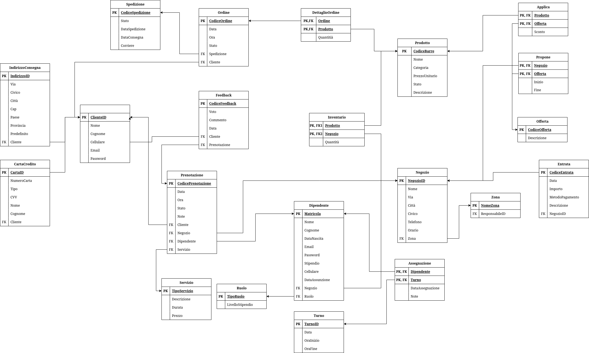

# Fase 3: Progettazione logica, fisica ed implementazione - TORVERBARBER

In questa fase ci occupiamo di riorganizzare lo schema concettuale e di tradurlo in schema logico.

## 1. Schema logico

{width="800" style="display: block; margin: 0 auto"}

### Normalizzazione

La normalizzazione è stata applicata per garantire che il database sia progettato in modo da ridurre al minimo la ridondanza dei dati e assicurare l'integrità delle informazioni. Durante il processo di progettazione, sono state considerate le principali forme normali (1NF, 2NF, 3NF) per ottenere uno schema logico ben strutturato, scalabile e privo di anomalie.

- #### Prima Forma Normale (1NF)

Lo schema rispetta la prima forma normale poiché:

Tutte le tabelle sono organizzate in formato tabellare, con righe e colonne ben definite.
Ogni colonna contiene valori atomici, evitando gruppi ripetuti o liste di valori multipli all'interno di una singola cella. Ad esempio, nella tabella DettaglioOrdine, ogni riga rappresenta un singolo prodotto associato a un ordine specifico, senza raggruppare più prodotti in un unico campo.
Le righe sono identificabili univocamente tramite una chiave primaria (PK) per ogni tabella.

#### Seconda Forma Normale (2NF)

Per garantire il rispetto della seconda forma normale, ogni tabella:

È già in 1NF.
Gli attributi non chiave dipendono completamente dalla chiave primaria, evitando dipendenze parziali. Ad esempio:
Nella tabella DettaglioOrdine, ogni attributo (come la quantità di prodotto) dipende interamente dalla chiave composta (CodiceOrdine e Prodotto).
Tabelle come Cliente separano correttamente le informazioni relative al cliente (nome, email, password), senza dipendenze parziali.

#### Terza Forma Normale (3NF)

Lo schema rispetta la terza forma normale poiché:

È già in 2NF.
Ogni attributo non chiave dipende direttamente e unicamente dalla chiave primaria, senza dipendenze transitive. Ad esempio:
Nella tabella Negozio, i dettagli della zona geografica (come il nome della zona) sono gestiti in una tabella separata (Zona), eliminando eventuali dipendenze transitive.
Nella tabella Feedback, attributi come "voto" e "commento" dipendono direttamente dalla chiave primaria del feedback.

### Relazioni

Le chiavi primarie sono identificate in **grassetto**, mentre le chiavi secondarie (o esterne) sono scritte in *corsivo*.

1. IndirizzoConsegna(**IndirizzoID**, Via, Civico, Cap, Città, Paese, Provincia, Predefinito, *Cliente*)
2. CartaCredito(**CartaID** ,NumeroCarta, Tipo, CVV, Nome, Cognome, *Cliente*)
3. Cliente(**ClienteID**, Nome, Cognome, Cellulare, Email, Password)
4. Ordine(**CodiceOrdine**, Data, Stato, Ora, *Cliente*, *Spedizione*)
5. DettaglioOrdine(**CodiceOrdine**, **Prodotto**, Quantità)
6. Spedizione(**CodiceSpedizione**, DataSpedizione, DataConsegna, Corriere)
7. Feedback(**CodiceFeedback**, Voto, Commento, Data, *Cliente*, *Prenotazione*)
8. Prenotazione(**CodicePrenotazione**, Data, Ora, Stato, Note, *Cliente*, *Negozio*, *Servizio*, *Dipendente*)
9. Negozio(**CodiceNegozio**, Nome, Via, Civico, CAP, Città, Telefono, Orario, *Zona*)
10. Zona(**NomeZona**, *ResponsabileID*)
11. Servizio(**TipoServizio**, Descrizione, Durata, Prezzo)
12. Dipendente(**Matricola**, Nome, Cognome, Email, DataNascita, Telefono, DataAssunzione, Stipendio, *Negozio*, *Ruolo*)
13. Ruolo(**TipoRuolo**, LivelloStipendio)
14. Turno(**CodiceTurno**, Data, OraInizio, OraFine)
15. Inventario(**CodiceNegozio**, **Prodotto**, Quantità)
16. Prodotto(**CodiceBarre**, Nome, Categoria, PrezzoUnitario, Descrizione, Stato)
17. Offerta(**CodiceOfferta**, Descrizione)
18. Propone(**CodiceNegozio**, **CodiceOfferta**, Inizio, Fine)
19. Applica(**Prodotto**, **CodiceOfferta**, Sconto)
20. Entrata(**CodiceEntrata**, Data, Importo, MetodoPagamento, Descrizione, *Negozio*)
21. Assegnazione(**Dipendente**, **Turno**, DataAssegnazione, Note)

## Carico applicativo

### Tabella de volumi

| **Concetto**          | **Volumi Stimati** | **Costrutto** |
|-----------------------|--------------------|---------------|
| **IndirizzoConsegna** | 1000               | E             |
| **CartaCredito**      | 500                | E             |
| **Cliente**           | 1500               | E             |
| **Ordine**            | 500                | E             |
| **DettaglioOrdine**   | 2000               | R             |
| **Spedizione**        | 500                | E             |
| **Feedback**          | 2000               | E             |
| **Prenotazione**      | 5000               | E             |
| **Negozio**           | 15                 | E             |
| **Zona**              | 10                 | E             |
| **Servizio**          | 10                 | E             |
| **Dipendente**        | 200                | E             |
| **Ruolo**             | 5                  | E             |
| **Turno**             | 1000               | E             |
| **Inventario**        | 1000               | R             |
| **Prodotto**          | 100                | E             |
| **Offerta**           | 100                | E             |
| **Propone**           | 500                | R             |
| **Applica**           | 1000               | R             |
| **Entrata**           | 5000               | E             |
| **Assegnazione**      | 100                | R             |

### Volume dei dati

| **Concetto**          | **Dimensione Record**                                              | **Volume**    |
|-----------------------|--------------------------------------------------------------------|---------------|
| **IndirizzoConsegna** | (4 + 100 + 10 + 5 + 50 + 50 + 2 + 1 + 4) bytes = **226 bytes**     | 226000 bytes  |
| **CartaCredito**      | (4 + 16 + 20 + 3 + 50 + 50 + 4) bytes = **147 bytes**              | 73500 bytes   |
| **Cliente**           | (4 + 50 + 50 + 15 + 100 + 64) bytes = **283 bytes**                | 424500 bytes  |
| **Ordine**            | (4 + 3 + 20 + 3 + 4 + 4) bytes = **38 bytes**                      | 19000 bytes   |
| **DettaglioOrdine**   | (4 + 8 + 4) bytes = **12 bytes**                                   | 24000 bytes   |
| **Spedizione**        | (4 + 3 + 3 + 50) bytes = **60 bytes**                              | 30000 bytes   |
| **Feedback**          | (4 + 1 + 255 + 3 + 4 + 4) bytes = **271 bytes**                    | 542000 bytes  |
| **Prenotazione**      | (4 + 3 + 3 + 20 + 255 + 4 + 4 + 4 + 4) bytes = **301 bytes**       | 1505000 bytes |
| **Negozio**           | (4 + 50 + 100 + 10 + 5 + 50 + 15 + 50 + 4) bytes = **288 bytes**   | 4320 bytes    |
| **Zona**              | (50 + 4) bytes = **54 bytes**                                      | 540 bytes     |
| **Servizio**          | (50 + 255 + 4 + 4) bytes = **313 bytes**                           | 3130 bytes    |
| **Dipendente**        | (4 + 50 + 50 + 100 + 3 + 15 + 3 + 4 + 4 + 4) bytes = **237 bytes** | 47400 bytes   |
| **Ruolo**             | (20 + 4) bytes = **24 bytes**                                      | 120 bytes     |
| **Turno**             | (4 + 3 + 3 + 3) bytes = **13 bytes**                               | 13000 bytes   |
| **Inventario**        | (4 + 8 + 4) bytes = **12 bytes**                                   | 12000 bytes   |
| **Prodotto**          | (8 + 50 + 50 + 4 + 255 + 20) bytes = **383 bytes**                 | 38300 bytes   |
| **Offerta**           | (4 + 255) bytes = **259 bytes**                                    | 25900 bytes   |
| **Propone**           | (4 + 4 + 3 + 3) bytes = **14 bytes**                               | 7000 bytes    |
| **Applica**           | (8 + 4 + 4) bytes = **12 bytes**                                   | 12000 bytes   |
| **Entrata**           | (4 + 3 + 4 + 20 + 255 + 4) bytes = **290 bytes**                   | 1450000 bytes |
| **Assegnazione**      | (4 + 4 + 3 + 255) bytes = **266 bytes**                            | 26600 bytes   |

**Tipi di dati stimati**:

- Interi (INT): 4 byte
- Stringhe variabili (VARCHAR): dimensione massima specificata
- Date (DATE): 3 byte
- Booleani: 1 byte

### Tabella delle operazioni

- Inserimento prenotazione -> 15 al giorno
- Visualizza i turni di tutti i dipendenti per una data giornata -> 2 al giorno
- Visualizza la prenotazione di un cliente -> 1 al giorno
- Visualizza le entrate di una giornata -> 1 al giorno