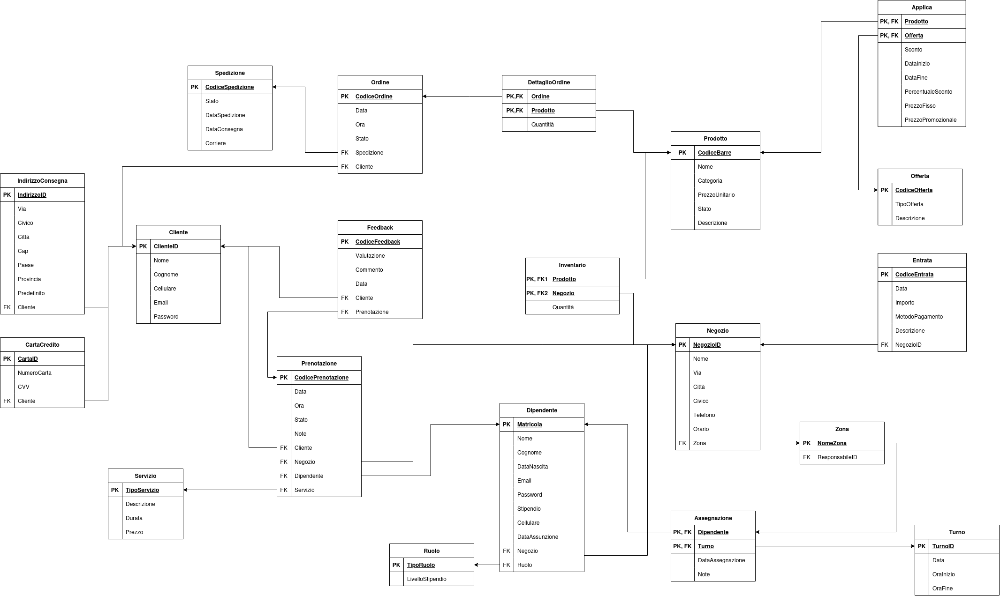

# Fase 3: Progettazione logica, fisica ed implementazione - TORVERBARBER

In questa fase ci occupiamo di riorganizzare lo schema concettuale e di tradurlo in schema logico.

## 1. Riorganizzazione e schema concettuale finale

## 2. Schema logico

{width="800" style="display: block; margin: 0 auto"}
