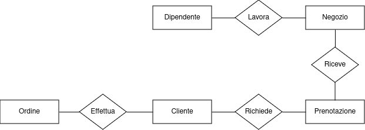
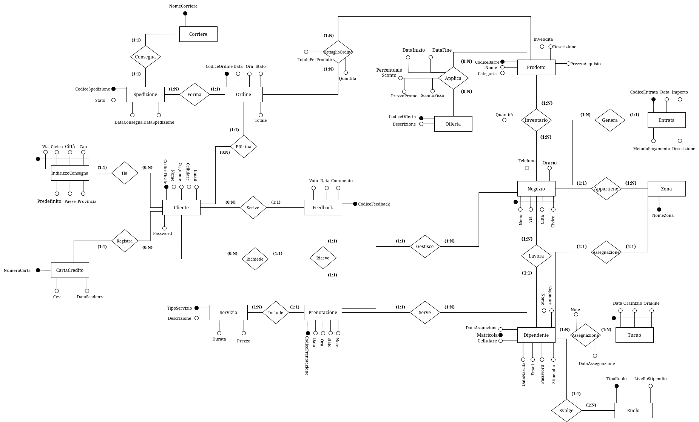

# TORVERBARBER

## Componenti del gruppo

| Nome           | Cognome   | Matricola | Mail                                          |
|----------------|-----------|-----------|-----------------------------------------------|
| Ionut Georgian | Zbirciog  | 0308984   | <ionutgeorgian.zbirciog@students.uniroma2.eu> |
| Francesco      | Cosciotti | 0323545   | <francesco.cosciotti@students.uniroma2.eu>    |
| Adriano        | Porzia    | 0327131   | <adriano.porzia@students.uniroma2.eu>         |

## Dominio Applicativo

L'applicazione **TORVERBARBER** mira a centralizzare le operazioni giornaliere di una catena di *barber shop*, facilitando la gestione per il personale e offrendo una piattaforma digitale intuitiva per i clienti.

---

## Obiettivi del Progetto

1. **Ottimizzare l'efficienza operativa**: garantire una gestione fluida delle prenotazioni, dei turni e delle vendite.
2. **Migliorare l’esperienza del cliente**: offrire strumenti digitali per prenotazioni, notifiche e personalizzazione dei servizi.
3. **Incrementare la fidelizzazione**: fornendo promozioni mirate e un’interfaccia che incentivi il ritorno dei clienti.
4. **Analisi strategiche**: fornire report dettagliati per migliorare le prestazioni aziendali.

---

## Raccolta dei Dati e Analisi dei Requisiti

### Analisi degli utenti

1. **Cliente**
    - L'applicazione è stata progettata per migliorare significativamente l'esperienza dei clienti, offrendo strumenti che semplificano l'accesso ai servizi e aumentano la fidelizzazione. Ogni cliente avrà la possibilità di creare un proprio profilo personale sulla piattaforma online. Durante la registrazione, verranno richiesti alcuni dati fondamentali come il nome, cognome, l’indirizzo email e il numero di cellulare. Questo profilo diventerà il punto di accesso principale per gestire tutte le funzionalità offerte dall’applicazione.

    - Tra le caratteristiche principali, c'è la possibilità di effettuare prenotazioni online in modo semplice e veloce. I clienti potranno scegliere il negozio più vicino, selezionare il barbiere preferito e definire i servizi desiderati. Inoltre, avranno sempre la possibilità di modificare o cancellare le prenotazioni in base alle loro esigenze.

    - Un altro elemento chiave è l'accesso allo storico dei servizi e degli acquisti. Questa funzionalità permette ai clienti di consultare i dettagli dei trattamenti ricevuti e dei prodotti acquistati in passato. Per quanto riguarda i prodotti, l’applicazione consente di effettuare ordini online per poi essere spediti all' utente.

    - Infine, i clienti avranno la possibilità di lasciare feedback e valutazioni sui servizi ricevuti. Questa funzionalità non solo permette loro di esprimere la propria opinione, ma aiuta anche il negozio a migliorare la qualità dei servizi offerti, rendendo il processo di miglioramento continuo un pilastro centrale dell’esperienza cliente.
2. **Dipendenti**
    L'applicazione offre strumenti dedicati allo staff, che è suddiviso in due categorie principali: dipendenti e manager. Ogni ruolo ha accesso a funzionalità personalizzate, progettate per ottimizzare le operazioni quotidiane.

    - I **barbieri** rappresentano il cuore operativo di ogni negozio. Attraverso l’applicazione, possono accedere facilmente al proprio profilo e visualizzare le prenotazioni che li riguardano. Hanno inoltre a disposizione un calendario aggiornato che consente loro di consultare i turni di lavoro, così da pianificare la giornata in modo efficiente. Inoltre, i barbieri possono registrare i servizi offerti ai clienti, che verranno automaticamente collegati al profilo del cliente per garantire uno storico dettagliato.

    - I **receptionist** svolgono un ruolo chiave nel mantenere il negozio operativo e nel supportare i clienti. Il loro compito principale è la gestione delle prenotazioni: grazie a un’interfaccia intuitiva, possono aggiungere, modificare o annullare appuntamenti in base alle esigenze del cliente o alle disponibilità dei barbieri. Sono anche il primo punto di contatto per i clienti che necessitano di assistenza, sia per questioni legate alle prenotazioni sia per problemi relativi agli acquisti. Infine, il receptionist monitora l’attività quotidiana del negozio, assicurandosi che tutto funzioni senza intoppi.

    - Ogni negozio è gestito da un **manager** che si occupa di coordinare le attività operative. Questo ruolo include la gestione dei turni dei barbieri, adattandoli alle necessità del negozio, e il controllo dell’inventario, verificando che le scorte siano sufficienti sia per la vendita sia per l’uso interno. Il responsabile si occupa anche delle comunicazioni con i fornitori, assicurando un flusso costante di materiali e prodotti. Infine, fornisce report regolari al manager di zona, così da mantenere una supervisione generale sull’andamento del negozio.

    - Il **responsabile di zona** supervisiona un insieme di negozi all’interno di una determinata area geografica. Questo ruolo richiede una visione globale delle performance di ogni negozio, analizzando report e dati forniti dai manager. Il manager di zona lavora per risolvere eventuali problematiche e garantire che i negozi rispettino gli standard qualitativi della catena. Inoltre, ha la responsabilità di pianificare promozioni e strategie per incrementare le vendite e la soddisfazione dei clienti su scala regionale.

    - Infine, il **CEO** è responsabile della supervisione complessiva della catena di *barber shop*. Questo ruolo si concentra sull’analisi strategica dei dati provenienti da tutti i negozi, identificando tendenze e opportunità per migliorare le operazioni. Il CEO definisce gli obiettivi aziendali a lungo termine, pianifica l’espansione del marchio e gestisce le relazioni con partner e investitori, garantendo così la crescita e la sostenibilità dell’intera catena.

---

La catena di negozi **TORVERBARBER** adotta una struttura gerarchica in cui ogni negozio è gestito da un **manager**, che a sua volta riferisce al **responsabile di zona**. Quest'ultimo è in diretto contatto con il **CEO** e supervisiona più negozi in una stessa zona o città. Ogni ruolo all'interno dello staff ha responsabilità specifiche, con una scala retributiva definita e una progressione salariale basata sugli anni di servizio.

#### Ruoli e Responsabilità

- **Receptionist:** Prima figura di contatto per i clienti, si occupano di accoglienza, gestione delle prenotazioni e supporto amministrativo.

- **Barbiere:** Responsabili dei servizi offerti ai clienti (tagli, trattamenti barba, ecc.).

- **Manager del negozio:** Gestisce le operazioni quotidiane del negozio, come turni, inventario e fornitori.

- **Responsabile di zona:** Supervisiona più negozi in una zona, collabora con i manager e mantiene il contatto diretto con il CEO.

- **CEO:** Guida l'azienda, definendo la strategia e supervisionando l'intera struttura.

---

### Glossario dei termini

|      **Entità**       |                                                        **Descrizione**                                                         |             **Sinonimi**              |
|:---------------------:|:------------------------------------------------------------------------------------------------------------------------------:|:-------------------------------------:|
|      **Negozio**      |     Punto vendita fisico appartenente alla catena di barberie, in cui si offrono servizi di taglio e prodotti in vendita.      |        Barberia, Punto Vendita        |
|    **Dipendente**     |                  Persona che lavora nella catena con ruoli specifici (barbiere, receptionist, manager, ecc.).                  |           Personale, Staff            |
|      **Cliente**      |  Persona che usufruisce dei servizi della catena, registrandosi nel sistema per prenotare appuntamenti o acquistare prodotti.  |          Utente, Consumatore          |
|  **CartaDiCredito**   |                  Strumento di pagamento registrato da un cliente per effettuare transazioni online o offline.                  |       Carta di debito, Bancomat       |
| **IndirizzoConsegna** |                     Luogo specifico indicato da un cliente per ricevere spedizioni di prodotti acquistati.                     | Indirizzo di spedizione, Destinazione |
|   **Prenotazione**    |    Richiesta di appuntamento effettuata da un cliente per uno o più servizi in un negozio specifico, a un orario definito.     |         Appuntamento, Booking         |
|      **Entrata**      |                       Registrazione delle somme ricevute da un negozio, derivanti da servizi e prodotti.                       |           Introito, Ricavo            |
|       **Turno**       |                        Fascia oraria assegnata ai dipendenti per svolgere le loro mansioni lavorative.                         |           Orario lavorativo           |
|     **Feedback**      |          Opinione del cliente relativa a un servizio o prodotto, che include una valutazione numerica e un commento.           |         Recensione, Opinione          |
|     **Prodotto**      |                         Oggetti disponibili per la vendita o l'uso interno nei servizi di un negozio.                          |         Articolo, Inventario          |
|      **Ordine**       |                 Richiesta di acquisto di prodotti da parte di un cliente, con ritiro in negozio o spedizione.                  |           Comanda, Acquisto           |
|    **Spedizione**     |                      Processo di consegna dei prodotti acquistati da un cliente a un indirizzo specifico.                      |          Consegna, Trasporto          |
|     **Corriere**      |                  Operatore incaricato della gestione e consegna dei prodotti acquistati online o in negozio.                   |       Trasportatore, Logistica        |
|       **Zona**        |                 Area geografica che comprende uno o più negozi ed è supervisionata da un responsabile di zona.                 |             Area, Regione             |
|      **Offerta**      |                 Promozione temporanea che prevede uno sconto su prodotti o servizi per incentivare le vendite.                 |          Sconto, Promozione           |
|       **Ruolo**       |                   Posizione lavorativa assegnata ai dipendenti, con responsabilità e retribuzione definiti.                    |          Posizione, Mansione          |
|     **Servizio**      | Prestazione professionale offerta ai clienti (es. taglio capelli, trattamento barba, ecc.), con specifiche di prezzo e durata. |        Prestazione, Operazione        |

---

### Vincoli

1. **Feedback**
   - **1.1** Ogni feedback deve essere univocamente associato a una **Prenotazione** completata.
   - **1.2** Un cliente può lasciare al massimo un solo feedback per ogni prenotazione effettuata.
   - **1.3** Il feedback deve includere un voto (es. da 1 a 5) e può includere un commento opzionale.

2. **Zona e Responsabile di Zona**
   - **2.1** Ogni zona deve essere associata a **uno e un solo responsabile di zona**.
   - **2.2** Un responsabile di zona può gestire esclusivamente una zona.
   - **2.3** Ogni negozio deve essere collegato a una **zona esistente** e non può appartenere a più di una zona.

3. **Staff e Turni**
   - **3.1** Ogni membro dello staff deve essere assegnato almeno a un **turno** per poter lavorare.
   - **3.2** I turni devono specificare un orario di **inizio** e di **fine**.

4. **Prenotazioni**
   - **6.1** Ogni prenotazione deve includere:
     - Un **cliente**.
     - Un **barbiere**.
     - Un **negozio**.
   - **6.2** Le prenotazioni devono essere effettuate per orari all'interno degli orari di apertura del negozio.
   - **6.3** Ogni prenotazione deve includere almeno un **servizio**.
   - **6.4** Lo stato di una prenotazione deve essere uno tra: *Confermata*, *Annullata* o *Completata*.
   - **6.8** La prenotazione rappresente il turno del cliente.

5. **Entrata**
   - **5.1** Ogni entrata deve avere:
     - Una **data**.
     - Un **importo positivo**.
     - Un **metodo di pagamento** (es. contanti, carta di credito, bonifico, ecc.).
   - **5.2** Le entrate devono essere associate a un **negozio specifico**.
   - **5.3** Le entrate possono provenire da:
     - Prenotazioni.
     - Vendite di prodotti.

6. **Inventario**
   - **6.1** Ogni negozio deve avere un inventario associato.
   - **6.2** La quantità di un prodotto nell'inventario non può essere negativa.
   - **6.3** Ogni prodotto deve appartenere a una **categoria** (es. shampoo, accessori).
   - **6.4** Ogni prodotto può essere di tipo:
     - *Interno* (solo per uso nei servizi).
     - *Vendita* (solo per vendita diretta).
     - *Entrambi* (uso interno e vendita).

7. **Offerte**
    - **7.1** Ogni offerta deve essere valida per un periodo di tempo specifico, con date di inizio e fine.
    - **7.2** Le offerte possono essere associate a uno o più negozi e/o prodotti specifici.
    - **7.3** Gli sconti devono essere applicabili solo ai prodotti inclusi nell'offerta.

8. **Ruoli**
    - **8.1** Ogni membro dello staff deve avere un **ruolo definito**, con mansioni specifiche.
    - **8.2** Ogni ruolo ha una scala salariale associata.

9. **Ordini**
    - **9.1** Gli ordini possono essere effettuati solo da clienti registrati.
    - **9.2** Ogni ordine deve includere almeno un prodotto disponibile nell'inventario.
    - **9.3** Gli ordini possono essere spediti tramite corrieri oppure il cliente può acquistare il prodotto andando nel negozio.
    - **9.4** Gli ordini devono riportare lo stato: *In Elaborazione*, *Spedito*, *Consegnato*, o *Annullato*.

10. **Relazioni Gerarchiche**
    - **10.1** Ogni negozio deve avere un **manager** assegnato.
    - **10.2** Ogni manager deve rispondere al **responsabile di zona** della sua area.
    - **10.3** I responsabili di zona rispondono al **CEO**, che supervisiona l'intera azienda.

11. **Registrazione Cliente**
    - **11.1** Al momento della registrazione sulla piattaforma online, il cliente è tenuto a inserire il proprio codice fiscale.

---

### Glossario delle entità

|      **Entità**       |                                              **Descrizione**                                              |                                               **Attributi**                                                |                   **Relazioni Coinvolte**                   |
|:---------------------:|:---------------------------------------------------------------------------------------------------------:|:----------------------------------------------------------------------------------------------------------:|:-----------------------------------------------------------:|
|      **Negozio**      |  Punto vendita fisico della catena di barberie, dove si offrono servizi di taglio e vendita di prodotti.  |                            **Nome**, **Via**, **Città**, **Civico**, Telefono, Orario                            | Dipendente, Inventario, Offerta, Prenotazione, Zona, Ordine |
|    **Dipendente**     |       Persona che lavora nella catena, con ruoli specifici (barbiere, receptionist, manager, ecc.).       | **MatricolaDipendente**, Nome, Cognome, DataAssunzione, DataNascita, Cellulare, Email, Password, Stipendio |             Ruolo, Negozio, Turno, Prenotazione             |
|      **Cliente**      |           Persona che utilizza i servizi o acquista prodotti, registrandosi tramite il sistema.           |                        **CodiceFiscale**, Nome, Cognome, Cellulare, Email, Password                        |   Prenotazione, Ordine, Feedback, Indirizzo, CartaCredito   |
|   **CartaCredito**    |            Carta di credito registrata dal cliente per effettuare pagamenti online o offline.             |                          **NumeroCarta**, Tipo, DataScadenza, CVV, Nome, Cognome                           |                           Cliente                           |
| **IndirizzoConsegna** |                Luogo specifico fornito dal cliente per la consegna di prodotti acquistati.                |                         **Via**, **Civico**, **Città**, **Cap**, Paese, Provincia, Predefinito                         |                           Cliente                           |
|   **Prenotazione**    |          Richiesta di appuntamento effettuata da un cliente per usufruire di uno o più servizi.           |                               **CodicePrenotazione**, Data, Ora, Stato, Note                               |   Cliente, Dipendente, Turno, Negozio, Feedback, Servizio   |
|      **Entrata**      |                    Registrazione dei ricavi generati da servizi o vendite di prodotti.                    |                    **CodiceEntrata**, Data, Importo, Tipo, MetodoPagamento, Descrizione                    |              Prenotazione, Inventario, Negozio              |
|       **Turno**       |                    Fascia oraria assegnata a un dipendente per lavorare in un negozio.                    |                                        **Data**, **OraInizio**, **OraFine**                                        |                  Dipendente, Prenotazione                   |
|     **Feedback**      |     Valutazione data da un cliente, con voto numerico e commento, dopo aver usufruito di un servizio.     |                                  **CodiceFeedback**, Voto, Commento, Data                                  |                        Prenotazione                         |
|     **Prodotto**      |               Articolo disponibile per la vendita o per l’uso durante i servizi nei negozi.               |                 **CodiceBarre**, Nome, PrezzoAcquisto, PrezzoVendita, Categoria, Vendibile                 |      Negozio, DettaglioOrdine, Movimentazioni, Offerta      |
|      **Ordine**       | Acquisto di uno o più prodotti da parte di un cliente, con possibilità di spedizione o ritiro in negozio. |                                 **CodiceOrdine**, Data, Ora, Stato, Totale                                 |            DettaglioOrdine, Cliente, Spedizione             |
|    **Spedizione**     |                        Operazione di consegna dei prodotti acquistati ai clienti.                         |                         **CodiceSpedizione**, DataSpedizione, DataConsegna, Stato                          |                      Ordine, Corriere                       |
|     **Corriere**      |                Operatore incaricato del trasporto e della consegna di prodotti ai clienti.                |                                              **NomeCorriere**                                              |                         Spedizione                          |
|       **Zona**        |                   Area geografica gestita da un responsabile e comprendente più negozi.                   |                                                **NomeZona**                                                |                     Dipendente, Negozio                     |
|      **Offerta**      |        Promozione temporanea o sconto applicato a prodotti o servizi per incrementare le vendite.         |                            **CodiceOfferta**, Descrizione, TipoOfferta                            |                     Negozio, Inventario                     |
|       **Ruolo**       |          Posizione lavorativa associata a un dipendente, con specifiche mansioni e retribuzione.          |                                      **TipoRuolo**, LivelloStipendio                                       |                         Dipendente                          |
|     **Servizio**      |   Prestazione offerta ai clienti (es. taglio capelli, trattamento barba) con durata e prezzo definiti.    |                               **TipoServizio**, Prezzo, Durata, Descrizione                                |                        Prenotazione                         |

---

### Diagramma Entity-Relationship

#### Schema Scheletro

Sono state individuate le seguenti entità principali. Il *Dipendente* lavora in un *Negozio*, il *Negozio* gestisce le *Prenotazioni*, i *Clienti* effettuano le *Prenotazioni* ed effettuano gli *Ordini*.

{width="300" style="display: block; margin: 0 auto"}

#### Raffinamenti

##### Raffinazione entità **Negozio**

1. **Negozio - Zona**
   - **Relazione:** *Appartiene*  
   - **Cardinalità:** 1 a N (Un negozio appartiene a una sola zona; una zona può includere più negozi).  
   - **Descrizione:** Ogni negozio è situato in una zona geografica specifica, gestita da un responsabile di zona. La zona facilita il coordinamento strategico e operativo tra più negozi appartenenti alla stessa area.  
2. **Negozio - Prodotto**
   - **Relazione:** *Inventario*
   - **Cardinalità:** N a N
     - Ogni **negozio** può avere **più prodotti** nel suo inventario.
     - Ogni **prodotto** può essere presente in **più negozi**.
   - **Descrizione:** Ogni negozio dispone di un inventario in cui vengono tracciati i prodotti disponibili per la vendita. La relazione permette di gestire informazioni relative ai prodotti presenti nei vari negozi, come quantità disponibili, prezzi specifici per negozio o altre caratteristiche legate alla vendita.
3. **Negozio - Entrata**
   - **Relazione:** *Genera*  
   - **Cardinalità:** 1 a N (Un negozio può registrare più entrate; ogni entrata è associata a un solo negozio).  
   - **Descrizione:** Ogni negozio genera entrate derivanti da servizi forniti e prodotti venduti. Questi dati sono tracciati per analizzare le performance economiche del negozio.
4. **Offerta - Prodotto**
   - **Relazione:** *Applica*
   - **Cardinalità:** N a N (Un'offertà può essere applicata a uno o più prodotti; ad un prodotto può essere applicata una o più offerte).
   - **Descrizione:** Le offerte applicano uno sconto ai prodotti.

{width="500" style="display: block; margin: 0 auto"}

---

##### Raffinazione entità **Dipendente**

1. **Dipendente - Turno**
   - **Relazione:** Assegnazione
   - **Cardinalità:** N a N (Un dipendente (barbiere, receptionist, manager) è assegnato a uno o più turni; Un turno è è assegnato a uno o più dipendenti (barbiere, receptionist, manager)).
   - **Descrizione:** I turni sono assegnati solamente ai barbieri, receptionist e ai manager del negozio, mentre il responsabile di zona e il CEO non hanno turni.
2. **Dipendente - Zona**
   - **Relazione:** Assegnazione
   - **Cardinalità:** 1 a 1 (Un dipendente (responsabile di zona) è assegnato ad una zona; Una zona è assegnata ad un unico dipendente (responsabile di zona)).
3. **Dipendente - Ruolo**
   - **Relazione:** Svolge
   - **Cardinalità:** 1 a N (Un dipendente svolge un'unico ruolo; un ruolo è svolto da più dipendente).

{width="500" style="display: block; margin: 0 auto"}

---

##### Raffinazione entità **Cliente**

1. **Cliente - Feedback**
   - **Relazione:** Scrive
   - **Cardinalità:** 1 a N (Un cliente può scrivere una o più recensioni; una recensione è scritta da un unico cliente).
2. **Cliente - IndirizzoConsegna**
   - **Relazione:** Ha
   - **Cardinalità:** 1 a N (Un cliente può avere uno o più indirizzi di consegna; un indirizzo di consegna è di un unico cliente).
3. **Cliente - CartaCredito**
   - **Relazione:** Registra
   - **Cardinalità:** 1 a N (un cliente può registrare uno o più carte di credito; una carta di credito è di un unico cliente).

{width="500" style="display: block; margin: 0 auto"}

---

##### Raffinazione entità **Prenotazione**

1. **Prenotazione - Servizio**
   - **Relazione:** Include
   - **Cardinalità:** 1 a N (Una prenotazione include un unico servizio (capelli, barba, capelli e barba etc...); Un servizio è incluso in più prenotazioni).
2. **Prenotazione - Feedback**
   - **Relazione:** Riceve
   - **Cardinalità:** 1 a 1 (Una prenotazione rivece un unica recensione; Una recensione è riferita ad una sola prenotazione).

{width="500" style="display: block; margin: 0 auto"}

---

##### Raffinazione entità **Ordine**

1. **Ordine - Prodotto**
   - **Relazione:** DettaglioOrdine
   - **Cardinalità:** N a N (Un ordine contiene uno o più prodotti; un prodotto è presente in uno o più ordini).
   - **Descrizione:** La relazione *DettaglioOrdine* rappresenta il *carrello* del cliente che effettua l'ordine, infatti in questa relazione ci sono gli attributi: `totalePerProdotto` e `Quantità`.
2. **Ordine - Spedizione**
   - **Relazione:** Forma
   - **Cardinalità:** 1 a N (Un ordine forma una spedizione; Una spedizione può essere formata da più ordini)
3. **Spedizione - Corriere**
   - **Relazione:** Consegna
   - **Cardinalità:** 1 a N (Una spedizione è consegnata da un unico corriere; un corrire consegna una o più spedizioni).

{width="500" style="display: block; margin: 0 auto"}

### Diagramma E-R Finale

Dopo aver rifinito le entità invidutate nello schema scheletro, otteniamo lo schema E-R finale.

{width="800" style="display: block; margin: 0 auto"}

---

## Schema logico

In questa fase ci occupiamo di riorganizzare lo schema concettuale e di tradurlo in schema logico.

{width="800" style="display: block; margin: 0 auto"}

### Normalizzazione

La normalizzazione è stata applicata per garantire che il database sia progettato in modo da ridurre al minimo la ridondanza dei dati e assicurare l'integrità delle informazioni. Durante il processo di progettazione, sono state considerate le principali forme normali (1NF, 2NF, 3NF) per ottenere uno schema logico ben strutturato, scalabile e privo di anomalie.

- #### Prima Forma Normale (1NF)

Lo schema rispetta la prima forma normale poiché:

Tutte le tabelle sono organizzate in formato tabellare, con righe e colonne ben definite.
Ogni colonna contiene valori atomici, evitando gruppi ripetuti o liste di valori multipli all'interno di una singola cella. Ad esempio, nella tabella DettaglioOrdine, ogni riga rappresenta un singolo prodotto associato a un ordine specifico, senza raggruppare più prodotti in un unico campo.
Le righe sono identificabili univocamente tramite una chiave primaria (PK) per ogni tabella.

#### Seconda Forma Normale (2NF)

Per garantire il rispetto della seconda forma normale, ogni tabella:

È già in 1NF.
Gli attributi non chiave dipendono completamente dalla chiave primaria, evitando dipendenze parziali. Ad esempio:
Nella tabella DettaglioOrdine, ogni attributo (come la quantità di prodotto) dipende interamente dalla chiave composta (CodiceOrdine e Prodotto).
Tabelle come Cliente separano correttamente le informazioni relative al cliente (nome, email, password), senza dipendenze parziali.

#### Terza Forma Normale (3NF)

Lo schema rispetta la terza forma normale poiché:

È già in 2NF.
Ogni attributo non chiave dipende direttamente e unicamente dalla chiave primaria, senza dipendenze transitive. Ad esempio:
Nella tabella Negozio, i dettagli della zona geografica (come il nome della zona) sono gestiti in una tabella separata (Zona), eliminando eventuali dipendenze transitive.
Nella tabella Feedback, attributi come "voto" e "commento" dipendono direttamente dalla chiave primaria del feedback.

---

### Relazioni

Le chiavi primarie sono identificate in **grassetto**, mentre le chiavi secondarie (o esterne) sono scritte in *corsivo*.

1. IndirizzoConsegna(**IndirizzoID**, Via, Civico, Cap, Città, Paese, Provincia, Predefinito, *Cliente*)
2. CartaCredito(**CartaID** ,NumeroCarta, CVV, *Cliente*)
3. Cliente(**ClienteID**, Nome, Cognome, Cellulare, Email, Password)
4. Ordine(**CodiceOrdine**, Data, Stato, Ora, *Cliente*, *Spedizione*)
5. DettaglioOrdine(**CodiceOrdine**, **Prodotto**, Quantità)
6. Spedizione(**CodiceSpedizione**, DataSpedizione, DataConsegna, Corriere)
7. Feedback(**CodiceFeedback**, Valutazione, Commento, Data, *Cliente*, *Prenotazione*)
8. Prenotazione(**CodicePrenotazione**, Data, Ora, Stato, Note, *Cliente*, *Negozio*, *Servizio*, *Dipendente*)
9. Negozio(**CodiceNegozio**, Nome, Via, Civico, CAP, Città, Telefono, Orario, *Zona*)
10. Zona(**NomeZona**, *ResponsabileID*)
11. Servizio(**TipoServizio**, Descrizione, Durata, Prezzo)
12. Dipendente(**Matricola**, Nome, Cognome, Email, DataNascita, Telefono, DataAssunzione, Stipendio, *Negozio*, *Ruolo*)
13. Ruolo(**TipoRuolo**, LivelloStipendio)
14. Turno(**CodiceTurno**, Data, OraInizio, OraFine)
15. Inventario(**CodiceNegozio**, **Prodotto**, Quantità)
16. Prodotto(**CodiceBarre**, Nome, Categoria, PrezzoUnitario, Descrizione, Stato)
17. Offerta(**CodiceOfferta**, Descrizione)
18. Applica(**Prodotto**, **CodiceOfferta**, DataInizio, DataFine, PercentualeSconto, ScontoFisso, PrezzoPromozionale)
19. Entrata(**CodiceEntrata**, Data, Importo, MetodoPagamento, Descrizione, *Negozio*)
20. Assegnazione(**Dipendente**, **Turno**, DataAssegnazione, Note)

---

## Carico applicativo

### Tabella de volumi

| **Concetto**          | **Volumi Stimati** | **Costrutto** |
|-----------------------|--------------------|---------------|
| **IndirizzoConsegna** | 1000               | E             |
| **CartaCredito**      | 500                | E             |
| **Cliente**           | 1500               | E             |
| **Ordine**            | 500                | E             |
| **DettaglioOrdine**   | 2000               | R             |
| **Spedizione**        | 500                | E             |
| **Feedback**          | 2000               | E             |
| **Prenotazione**      | 5000               | E             |
| **Negozio**           | 15                 | E             |
| **Zona**              | 10                 | E             |
| **Servizio**          | 10                 | E             |
| **Dipendente**        | 200                | E             |
| **Ruolo**             | 5                  | E             |
| **Turno**             | 1000               | E             |
| **Inventario**        | 1000               | R             |
| **Prodotto**          | 100                | E             |
| **Offerta**           | 100                | E             |
| **Applica**           | 1000               | R             |
| **Entrata**           | 5000               | E             |
| **Assegnazione**      | 100                | R             |

### Volume dei dati

| **Concetto**          | **Dimensione Record**                                              | **Volume**    |
|-----------------------|--------------------------------------------------------------------|---------------|
| **IndirizzoConsegna** | (4 + 100 + 10 + 5 + 50 + 50 + 2 + 1 + 4) bytes = **226 bytes**     | 226000 bytes  |
| **CartaCredito**      | (4 + 16 + 20 + 3 + 50 + 50 + 4) bytes = **147 bytes**              | 73500 bytes   |
| **Cliente**           | (4 + 50 + 50 + 15 + 100 + 64) bytes = **283 bytes**                | 424500 bytes  |
| **Ordine**            | (4 + 3 + 20 + 3 + 4 + 4) bytes = **38 bytes**                      | 19000 bytes   |
| **DettaglioOrdine**   | (4 + 8 + 4) bytes = **12 bytes**                                   | 24000 bytes   |
| **Spedizione**        | (4 + 3 + 3 + 50) bytes = **60 bytes**                              | 30000 bytes   |
| **Feedback**          | (4 + 1 + 255 + 3 + 4 + 4) bytes = **271 bytes**                    | 542000 bytes  |
| **Prenotazione**      | (4 + 3 + 3 + 20 + 255 + 4 + 4 + 4 + 4) bytes = **301 bytes**       | 1505000 bytes |
| **Negozio**           | (4 + 50 + 100 + 10 + 5 + 50 + 15 + 50 + 4) bytes = **288 bytes**   | 4320 bytes    |
| **Zona**              | (50 + 4) bytes = **54 bytes**                                      | 540 bytes     |
| **Servizio**          | (50 + 255 + 4 + 4) bytes = **313 bytes**                           | 3130 bytes    |
| **Dipendente**        | (4 + 50 + 50 + 100 + 3 + 15 + 3 + 4 + 4 + 4) bytes = **237 bytes** | 47400 bytes   |
| **Ruolo**             | (20 + 4) bytes = **24 bytes**                                      | 120 bytes     |
| **Turno**             | (4 + 3 + 3 + 3) bytes = **13 bytes**                               | 13000 bytes   |
| **Inventario**        | (4 + 8 + 4) bytes = **12 bytes**                                   | 12000 bytes   |
| **Prodotto**          | (8 + 50 + 50 + 4 + 255 + 20) bytes = **383 bytes**                 | 38300 bytes   |
| **Offerta**           | (4 + 255) bytes = **259 bytes**                                    | 25900 bytes   |
| **Applica**           | (8 + 4 + 4) bytes = **12 bytes**                                   | 12000 bytes   |
| **Entrata**           | (4 + 3 + 4 + 20 + 255 + 4) bytes = **290 bytes**                   | 1450000 bytes |
| **Assegnazione**      | (4 + 4 + 3 + 255) bytes = **266 bytes**                            | 26600 bytes   |

**Tipi di dati stimati**:

- Interi (INT): 4 byte
- Stringhe variabili (VARCHAR): dimensione massima specificata
- Date (DATE): 3 byte
- Booleani: 1 byte

---

### Tabella delle operazioni

#### Di seguito sono mostrare alcune operazione che saranno implementate come View

##### 1. Visualizzare i turni di tutti i dipendenti per una data giornata

- Mostra tutti i turni assegnati ai dipendenti in una determinata data.
- Include dati del dipendente, orari di inizio e fine turno, negozio associato.

| Concetto     | Costrutto | Accessi | Tipo | Frequenza  |
|--------------|-----------|---------|------|------------|
| Turno        | E         | 1       | S    | 2 / giorno |
| Assegnazione | R         | 1       | S    |            |
| Dipendente   | E         | 1       | S    |            |

```Sql
CREATE VIEW
    Dsiposizione_Turni AS
SELECT
    d.DipendenteId AS Matricola,
    d.Nome,
    d.Cognome,
    n.Nome AS Negozio,
    r.tipoRuolo AS Ruolo,
    a.Note,
    t.Data,
    t.OraInizio,
    t.OraFine
FROM
    Dipendente d
    JOIN Ruolo r ON d.RuoloId = r.RuoloId
    JOIN Negozio n ON d.NegozioId = n.NegozioId
    JOIN AssegnazioneTurno a ON d.DipendenteId = a.DipendenteId
    JOIN Turno t ON t.TurnoId = a.TurnoId
WHERE
    Data = "2024-02-14";
```

| Matricola | Nome      | Cognome    | Negozio                                | Ruolo                | Note     | Data       | OraInizio | OraFine  |
|-----------|----------|------------|-----------------------------------------|----------------------|----------|------------|----------|---------|
| 46        | Michela  | Vidoni     | Bonaventura SPA                        | Responsabile di Zona | NULL     | 2024-02-14 | 08:00:00 | 16:00:00 |
| 143       | Carmelo  | Luciano    | Benussi-Sabbatini s.r.l.               | Responsabile di Zona | NULL     | 2024-02-14 | 08:00:00 | 16:00:00 |
| 174       | Ugo      | Giacconi   | Toldo-Rosiello SPA                     | Barbiere             | Apertura | 2024-02-14 | 08:00:00 | 16:00:00 |
| 216       | Jolanda  | Botticelli | Pietragneli-Gulotta s.r.l.             | Responsabile di Zona | NULL     | 2024-02-14 | 08:00:00 | 16:00:00 |
| 218       | Vittoria | Bertolucci | Toldo-Rosiello SPA                     | Responsabile di Zona | NULL     | 2024-02-14 | 08:00:00 | 16:00:00 |
| 225       | Beatrice | Cremonesi  | Bonaventura SPA                        | Barbiere             | Apertura | 2024-02-14 | 08:00:00 | 16:00:00 |
| 21        | Gelsomina| Marsili    | Ferrucci-Catalano SPA                  | Receptionist         | Chiusura | 2024-02-14 | 14:00:00 | 22:00:00 |
| 75        | Erika    | Cagnin     | Zito-Pignati e figli                   | Receptionist         | Chiusura | 2024-02-14 | 14:00:00 | 22:00:00 |
| 208       | Dolores  | Persico    | Vittadello, Mazzanti e Castelli e figli | Barbiere             | Chiusura | 2024-02-14 | 14:00:00 | 22:00:00 |

##### 2. Visualizzare tutte le prenotazioni di un cliente

- Elenco delle prenotazioni di un cliente con dettagli su stato, data, ora, negozio e servizio scelto.  
- Utile per mostrare lo storico delle prenotazioni.

| Concetto     | Costrutto | Accessi | Tipo | Frequenza  |
|--------------|-----------|---------|------|------------|
| Prenotazione | E         | 1       | S    | 5 / giorno |
| Cliente      | E         | 1       | S    |            |
| Negozio      | E         | 1       | S    |            |
| Servizio     | E         | 1       | S    |            |

```Sql
CREATE VIEW
    Prenotazione_Per_Cliente AS
SELECT
    c.Nome AS Nome_Cliente,
    c.cognome AS Cognome_Cliente,
    p.dataPrenotazione,
    p.oraPrenotazione,
    p.stato,
    p.note,
    n.nome AS Negozio,
    d.nome,
    d.cognome,
    s.nome AS Servizio
FROM
    Prenotazione p
    JOIN Servizio s ON s.ServizioId = p.ServizioId
    JOIN Dipendente d ON p.DipendenteId = d.DipendenteId
    JOIN Negozio n ON p.NegozioId = n.NegozioId
    JOIN Cliente c ON p.ClienteId = c.ClienteId
WHERE
    c.Nome = "Filippo"
    AND c.Cognome = "Gussoni";
```

| Nome_Cliente | Cognome_Cliente | dataPrenotazione | oraPrenotazione | stato      | note          | Negozio                               | nome    | cognome    | Servizio                    |
|-------------|----------------|------------------|----------------|------------|--------------|--------------------------------------|---------|-----------|-----------------------------|
| Filippo     | Gussoni        | 2024-09-27       | 16:24:54       | Completato | Tinta        | Murialdo, Pratesi e Antonioni s.r.l. | Raffaello | Geraci    | Colpi di Sole               |
| Filippo     | Gussoni        | 2025-01-10       | 05:38:18       | In attesa  | Doppio taglio| Marino-Musatti Group                 | Silvia   | Pascarella | Taglio Completo + Barba     |
| Filippo     | Gussoni        | 2024-12-05       | 22:57:36       | Completato | NULL         | Donà-Druso Group                     | Cristina | Taliani    | Trattamento Anticaduta      |

##### 3. Visualizzare tutti gli ordini di un cliente

- Elenco degli ordini di un cliente con dettagli su data, stato e prodotti inclusi.  
- Permette di visualizzare il totale degli acquisti effettuati.  

| Concetto        | Costrutto | Accessi | Tipo | Frequenza  |
|-----------------|-----------|---------|------|------------|
| Ordine          | E         | 1       | S    | 5 / giorno |
| Cliente         | E         | 1       | S    |            |
| DettaglioOrdine | R         | 1       | S    |            |
| Prodotto        | E         | 1       | S    |            |

```Sql

CREATE VIEW
    Ordini_Per_Cliente AS
SELECT
    o.stato AS StatoOrdine,
    o.dataOrdine,
    p.Nome AS NomeProdotto
FROM
    Ordine o
    JOIN DettaglioOrdine d ON d.OrdineId = o.OrdineId
    JOIN Prodotto p ON p.ProdottoID = d.ProdottoID
    JOIN Cliente c ON o.ClienteId = c.ClienteId
WHERE
    c.nome = 'Tullio'
    AND c.cognome = 'Versace';
```

| StatoOrdine | dataOrdine | NomeProdotto              |
|-------------|------------|---------------------------|
| Consegnato  | 2024-09-04 | Shampoo Nivea             |
| Rifiutato   | 2024-08-08 | Balsamo Acqua di Bolgheri |
| Rifiutato   | 2024-08-08 | Cera Modellante           |
| Rifiutato   | 2024-08-08 | Gel Fissativo Extra Forte |
| Rifiutato   | 2024-08-08 | Olio da Barba             |
| Consegnato  | 2024-12-03 | Crema Pre-Barba           |
| Spedito     | 2024-04-06 | Schiuma da Barba          |
| Spedito     | 2024-04-06 | Lozione Dopobarba         |

##### 4. Dipendenti di un negozio ordinati per ruolo e anzianità

- Mostra i dipendenti di un negozio ordinati per ruolo e data di assunzione.

| Concetto   | Costrutto | Accessi | Tipo | Frequenza |
|------------|-----------|---------|------|-----------|
| Dipendente | E         | 1       | S    | 5 / mese  |
| Negozio    | E         | 1       | S    |           |
| Ruolo      | E         | 1       | S    |           |

```Sql
CREATE VIEW
    Visualizza_Dipendenti AS
SELECT
    d.dataAssunzione,
    d.nome,
    d.cognome,
    r.tipoRuolo AS Ruolo
FROM
    Dipendente d
    JOIN Ruolo r ON d.RuoloId = r.RuoloId
    JOIN Negozio n ON n.NegozioId = d.NegozioId
ORDER BY
    r.tipoRuolo,
    d.dataAssunzione;
```

| dataAssunzione | nome     | cognome   | Ruolo    |
|----------------|----------|-----------|----------|
| 2011-06-09     | Lorenzo  | Turchetta | Barbiere |
| 2011-10-14     | Giorgio  | Gasperi   | Barbiere |
| 2012-02-27     | Vittorio | Mazzanti  | Barbiere |
| 2012-05-19     | Milo     | Veneziano | Barbiere |
| 2013-01-04     | Alessio  | Montesano | Barbiere |
| 2013-05-25     | Pino     | Papetti   | Barbiere |
| 2014-10-19     | Mirco    | Deledda   | Barbiere |
| 2016-07-02     | Toni     | Giradello | Barbiere |
| 2017-03-24     | Paolo    | Salvini   | Barbiere |

##### 5. Visualizzare le prenotazioni con dettagli cliente e negozio ordinate per data

- Elenco delle prenotazioni effettuate in totale, in tutti i negozi per tutti i clienti, ordinate cronologicamente.

| Concetto     | Costrutto | Accessi | Tipo | Frequenza   |
|--------------|-----------|---------|------|-------------|
| Prenotazione | E         | 1       | S    | 1 / giorno  |
| Cliente      | E         | 1       | S    |             |
| Negozio      | E         | 1       | S    |             |

```Sql
CREATE VIEW
    Prenotazioni_Clienti AS
SELECT
    c.nome,
    c.cognome,
    p.dataPrenotazione,
    p.oraPrenotazione,
    n.nome AS NomeNegozio
FROM
    Prenotazione p
    JOIN Cliente c ON c.ClienteId = p.ClienteId
    JOIN Negozio n ON n.NegozioId = p.NegozioId
ORDER BY
    p.dataPrenotazione,
    p.oraPrenotazione;
```

| nome      | cognome  | dataPrenotazione | oraPrenotazione | NomeNegozio                            |
|-----------|----------|------------------|-----------------|----------------------------------------|
| Amedeo    | Sanudo   | 2024-02-17       | 00:20:37        | Ubaldi s.r.l.                          |
| Vittorio  | Fantozzi | 2024-02-17       | 04:33:41        | Turrini SPA                            |
| Antonio   | Fantini  | 2024-02-17       | 10:05:39        | Calbo, Procacci e Boito s.r.l.         |
| Ubaldo    | Porzio   | 2024-02-17       | 11:16:10        | Modugno e figli                        |
| Donato    | Solari   | 2024-02-17       | 12:41:05        | Zito, Sbarbaro e Crispi SPA            |
| Francesco | Palombi  | 2024-02-17       | 16:43:16        | Gottardi, Toscanini e Parpinel e figli |
| Ludovico  | Iannuzzi | 2024-02-18       | 01:52:06        | Modugno e figli                        |
| Vincenzo  | Piazzi   | 2024-02-18       | 02:54:38        | Cutuli e figli                         |

##### 6. Visualizzare i prodotti all'interno dell'inventario di un negozio

- Mostra i prodotti disponibili in un negozio con la quantità in magazzino.  
- Aiuta nella gestione dello stock.

| Concetto   | Costrutto | Accessi | Tipo | Frequenza     |
|------------|-----------|---------|------|---------------|
| Negozio    | E         | 1       | S    | 1 / settimana |
| Inventario | R         | 1       | S    |               |
| Prodotto   | E         | 1       | S    |               |

```Sql
CREATE VIEW
    Inventario_Negozio AS
SELECT
    p.nome,
    p.categoria,
    i.quantita,
    n.nome AS NomeNegozio
FROM
    Inventario i
    JOIN Prodotto p ON i.ProdottoId = p.ProdottoId
    JOIN Negozio n ON i.NegozioId = n.NegozioId
WHERE
    n.nome = 'BarberiaNord';
```

| nome                  | categoria       | quantità | NomeNegozio |
|-----------------------|-----------------|----------|-------------|
| Crema Modellante      | Altro           | 430      | Roero Group |
| Balsamo Idratante     | Balsamo         | 474      | Roero Group |
| Rasoio Classico       | Rasoi Manuali   | 442      | Roero Group |
| Cera per Capelli      | Altro           | 256      | Roero Group |
| Forbici Professionali | Strumenti       | 412      | Roero Group |
| Rasoio Elettrico      | Rasoi Elettrici | 364      | Roero Group |
| Shampoo Nutriente     | Shampoo         | 151      | Roero Group |

##### 7. Visualizzare tutti gli ordini relativi ad un prodotto

- Elenco degli ordini in cui è stato acquistato un determinato prodotto.  
- Utile per monitorare la popolarità di un articolo.

| Concetto        | Costrutto | Accessi | Tipo | Frequenza     |
|-----------------|-----------|---------|------|---------------|
| Ordine          | E         | 1       | S    | 1 / settimana |
| DettaglioOrdine | R         | 1       | S    |               |
| Prodotto        | E         | 1       | S    |               |

```Sql
CREATE VIEW
    Ordini_Per_Prodotto AS
SELECT
    o.dataOrdine,
    o.stato
FROM
    Prodotto p
    JOIN DettaglioOrdine d ON d.ProdottoId = p.ProdottoId
    JOIN Ordine o ON o.OrdineId = d.OrdineId
WHERE
    p.nome = 'Balsamo Pantene';
```

| dataOrdine | stato      |
|------------|------------|
| 2025-02-09 | Annullato  |
| 2024-06-27 | Rifiutato  |
| 2024-07-28 | Spedito    |
| 2024-10-05 | Elaborato  |
| 2024-06-09 | Consegnato |
| 2024-08-19 | Spedito    |
| 2024-04-03 | Consegnato |
| 2024-09-09 | Elaborato  |
| 2024-06-27 | Annullato  |
| 2024-09-24 | Rifiutato  |

##### 8. Visualizzare tutte le offerte r09elative ad un prodotto

- Mostra le offerte attive per un prodotto, inclusi sconti e prezzi promozionali.  
- Aiuta a tenere traccia delle promozioni in corso.  

| Concetto | Costrutto | Accessi | Tipo | Frequenza     |
|----------|-----------|---------|------|---------------|
| Offerta  | E         | 1       | S    | 1 / settimana |
| Applica  | R         | 1       | S    |               |
| Prodotto | E         | 1       | S    |               |

```Sql
CREATE VIEW
    Offerte_Per_Prodotto AS
SELECT
    o.tipoOfferta,
    a.dataInizio,
    a.dataFine,
    a.PercentualeSconto,
    a.PrezzoPromozionale,
    o.tipoOfferta,
    o.descrizione
FROM
    ApplicaOfferta a
    JOIN Offerta o ON a.OffertaId = o.OffertaId
    JOIN Prodotto p ON a.ProdottoId = p.ProdottoId
WHERE
    p.nome = 'Rasoio Philips'
    AND p.Vendibille = 1;
```

| Data Inizio | Data Fine  | Percentuale Sconto | Prezzo Promozionale | Tipo Offerta   | Descrizione                                                                                               |
|-------------|------------|--------------------|---------------------|----------------|-----------------------------------------------------------------------------------------------------------|
| 2024-04-22  | 2025-07-19 | *NULL*             | 45               | Sconto Fisso   | Rasoio di sicurezza in acciaio inox con testina regolabile per una rasatura personalizzata.               |
| 2024-03-16  | 2024-12-27 | *NULL*             | 50               | Promo Speciale | Rasoio a mano libera in edizione limitata, con impugnatura in legno di noce e lama affilata a mano.       |
| 2024-07-19  | 2025-04-16 | *NULL*             | 25                | Promo Speciale | Rasoio con testina a doppia lama, perfetto per una rasatura profonda e precisa.                           |
| 2024-06-09  | 2025-01-04 | 40              | *NULL*              | Percentuale    | Sconto del 40% su un rasoio di sicurezza con manico ergonomico per una presa salda e sicura.           |
| 2024-06-03  | 2024-12-21 | *NULL*             | *20*              | Sconto Fisso   | Offerta speciale su un rasoio a cartuccia con testine intercambiabili per una rasatura scorrevole.        |
| 2024-09-30  | 2025-10-11 | *NULL*             | *20*              | Percentuale    | Sconto su un rasoio elettrico con tecnologia a lame flottanti per una rasatura precisa e delicata.        |
| 2024-04-11  | 2026-01-02 | *NULL*             | 20               | Sconto Fisso   | Rasoio classico con testina aperta e design vintage, perfetto per gli amanti della rasatura tradizionale. |

##### 9. Visualizzare tutti i feedback lasciati da un cliente

- Elenco delle recensioni scritte da un cliente con valutazione, commento e data.  

| Concetto     | Costrutto | Accessi | Tipo | Frequenza |
|--------------|-----------|---------|------|-----------|
| Feedback     | E         | 1       | S    | 5 / mese  |
| Cliente      | E         | 1       | S    |           |
| Prenotazione | E         | 1       | S    |           |

```Sql
CREATE VIEW
    Feedback_Per_Utente AS
SELECT
    p.dataPrenotazione,
    p.oraPrenotazione,
    f.valutazione,
    f.commento,
    f.dataFeedback
FROM
    Feedback f
    JOIN Cliente c ON c.ClienteId = f.ClienteId
    JOIN Prenotazione p ON p.PrenotazioneId = f.PrenotazioneId
WHERE
    c.nome = 'Mario'
    and c.cognome = 'Rossi'
```

| Data Prenotazione | Ora Prenotazione | Valutazione | Commento                                                                                                                 | Data Feedback |
|-------------------|------------------|-------------|--------------------------------------------------------------------------------------------------------------------------|---------------|
| 2024-08-20        | 10:30:00         | 3           | Il taglio è stato buono, ma la rasatura non era perfettamente uniforme. Il barbiere è stato comunque gentile.            | 2024-8-21    |
| 2024-03-27        | 15:45:00         | 4           | Ottima esperienza! Il barbiere è stato molto attento ai dettagli e la rasatura è stata impeccabile. Tornerò sicuramente. | 2024-03-27    |
| 2024-09-13        | 08:15:00         | 3           | Ambiente accogliente e personale cortese, ma ho dovuto aspettare più del previsto per il mio appuntamento.               | 2024-09-14    |

##### 10. Visualizzare tutti i feedback relativi ad un dipendente

- Mostra tutte le recensioni ricevute da un dipendente con valutazione e commento.  

| Concetto   | Costrutto | Accessi | Tipo | Frequenza |
|------------|-----------|---------|------|-----------|
| Feedback   | E         | 1       | S    | 5 / mese  |
| Dipendente | E         | 1       | S    |           |

```Sql
CREATE VIEW
    Feedback_Per_Dipendente
SELECT
    d.DipendenteId,
    p.dataPrenotazione,
    p.oraPrenotazione,
    c.nome AS NomeCliente,
    c.cognome CognomeCliente,
    f.valutazione,
    f.commento,
    f.dataFeedback
FROM
    Feedback f
    JOIN Cliente c ON f.ClienteId = c.ClienteId
    JOIN Prenotazione p ON f.PrenotazioneId = p.PrenotazioneId
    JOIN Dipendente d ON d.DipendenteId = p.DipendenteId
WHERE
    d.nome = 'Stefani'
    AND d.cognome = 'Gianinazzi';
```

| Dipendente ID | Data Prenotazione | Ora Prenotazione | Nome Cliente | Cognome Cliente | Valutazione | Commento                                                                                         | Data Feedback |
|---------------|-------------------|------------------|--------------|-----------------|-------------|--------------------------------------------------------------------------------------------------|---------------|
| 219           | 2024-12-30        | 10:30:00         | Gino         | Galtarossa      | 1           | Il taglio non è stato eseguito come richiesto. Il servizio poteva essere più curato.             | 2024-12-30    |
| 219           | 2024-11-15        | 14:15:00         | Marco        | Bianchi         | 4           | Ottimo servizio, il barbiere è stato molto attento ai dettagli e ha rispettato le mie richieste. | 2024-11-16    |
| 219           | 2024-10-05        | 09:00:00         | Luca         | Rossi           | 3           | Taglio discreto, ma il tempo di attesa è stato un po' lungo nonostante la prenotazione.          | 2024-10-07    |
| 219           | 2024-09-20        | 17:45:00         | Andrea       | Verdi           | 5           | Servizio eccellente! Il miglior taglio che abbia mai ricevuto, tornerò sicuramente.              | 2024-09-22    |
| 219           | 2024-08-08        | 12:00:00         | Stefano      | Conti           | 2           | Il barbiere è stato gentile, ma il risultato finale non mi ha soddisfatto del tutto.             | 2024-08-10    |

#### Di seguito sono mostrate delle query più complesse che possono beneficiare di indicizzazione e ottimizzazioni

##### 1. Calcolo delle entrate giornaliere di un negozio

- Determina le entrate totali di un negozio in una specifica giornata.  

| Concetto  | Costrutto | Accessi | Tipo | Frequenza  |
|-----------|-----------|---------|------|------------|
| Entrata   | E         | 1       | S    | 1 / giorno |
| Negozio   | E         | 1       | S    |            |

##### 2. Calcolo delle vendite totali per prodotto

- Conta quanti pezzi di un determinato prodotto sono stati venduti.  

| Concetto        | Costrutto | Accessi | Tipo | Frequenza     |
|-----------------|-----------|---------|------|---------------|
| Ordine          | E         | 1       | S    | 1 / settimana |
| DettaglioOrdine | R         | 1       | S    |               |
| Prodotto        | E         | 1       | S    |               |

##### 3. Numero medio di appuntamenti per dipendente al mese

- Calcola la media delle prenotazioni gestite da ogni dipendente su base mensile.  

| Concetto     | Costrutto | Accessi | Tipo | Frequenza  |
|--------------|-----------|---------|------|------------|
| Prenotazione | E         | 1       | S    | 1 / mese   |
| Dipendente   | E         | 1       | S    |            |

##### 4. Percentuale di prenotazioni cancellate rispetto al totale

- Determina il rapporto tra prenotazioni cancellate e prenotazioni totali.  

| Concetto     | Costrutto | Accessi | Tipo | Frequenza  |
|--------------|-----------|---------|------|------------|
| Prenotazione | E         | 1       | S    | 1 / mese   |

##### 5. Elenco dei clienti con il totale speso negli ultimi sei mesi

- Calcola la spesa totale di ciascun cliente considerando gli ultimi sei mesi.  

| Concetto        | Costrutto | Accessi | Tipo | Frequenza  |
|-----------------|-----------|---------|------|------------|
| Cliente         | E         | 1       | S    | 1 / mese   |
| Ordine          | E         | 1       | S    |            |
| DettaglioOrdine | R         | 1       | S    |            |
| Prodotto        | E         | 1       | S    |            |

##### 6. Lista dei clienti che hanno acquistato almeno 3 volte nell’ultimo anno

- Seleziona i clienti con almeno tre ordini registrati nell’ultimo anno.  

| Concetto | Costrutto | Accessi | Tipo | Frequenza  |
|----------|-----------|---------|------|------------|
| Cliente  | E         | 1       | S    | 1 / mese   |
| Ordine   | E         | 1       | S    |            |

##### 7. Elenco di tutti i feedback con valutazione maggiore di 4

- Mostra i dipendenti che hanno ricevuto un feedback con valutazione superiore a 4.  

| Concetto   | Costrutto | Accessi | Tipo | Frequenza     |
|------------|-----------|---------|------|---------------|
| Feedback   | E         | 1       | S    | 1 / settimana |
| Dipendente | E         | 1       | S    | 1 / settimana |

## Query in algebra relazionale

### 1. Zbirciog

### 2. Cosciotti

### 3. Porzia

## Schema Fisico

{width="800" style="display: block; margin: 0 auto"}

```Sql
use Torverbarber;

CREATE TABLE
    IF NOT EXISTS Cliente (
        ClienteId INT AUTO_INCREMENT PRIMARY KEY,
        nome VARCHAR(50) NOT NULL,
        cognome VARCHAR(50) NOT NULL,
        email VARCHAR(100) UNIQUE NOT NULL,
        password VARCHAR(255) NOT NULL, -- Password criptata con hashing
        cellulare VARCHAR(20),
        dataRegistrazione TIMESTAMP DEFAULT CURRENT_TIMESTAMP
    ) ENGINE = INNODB;

CREATE TABLE
    IF NOT EXISTS CartaCredito (
        CartaCreditoId INT AUTO_INCREMENT PRIMARY KEY,
        numeroCarta VARCHAR(16) UNIQUE NOT NULL,
        dataScadenza DATE NOT NULL,
        cvv VARCHAR(4) NOT NULL,
        ClienteId INT NOT NULL,
        FOREIGN KEY (ClienteId) REFERENCES Cliente (ClienteId) ON DELETE CASCADE
    ) ENGINE = INNODB;

CREATE TABLE
    IF NOT EXISTS IndirizzoConsegna (
        IndirizzoId INT AUTO_INCREMENT PRIMARY KEY,
        via VARCHAR(100) NOT NULL,
        civico VARCHAR(10) NOT NULL,
        citta VARCHAR(50) NOT NULL,
        cap VARCHAR(10) NOT NULL,
        paese VARCHAR(50) NOT NULL,
        provincia VARCHAR(50) NOT NULL,
        predefinito TINYINT (1) DEFAULT 0 CHECK (predefinito IN (0, 1)),
        ClienteId INT NOT NULL,
        FOREIGN KEY (ClienteId) REFERENCES Cliente (ClienteId) ON DELETE CASCADE
    ) ENGINE = INNODB;

CREATE TABLE
    IF NOT EXISTS Spedizione (
        SpedizioneId INT AUTO_INCREMENT PRIMARY KEY,
        dataSpedizione DATE NOT NULL,
        dataConsegna DATE,
        corriere VARCHAR(50),
        stato ENUM (
            'In preparazione',
            'In transito',
            'Consegnato',
            'Reso',
            'Annullata'
        ) NOT NULL,
        CHECK (
            dataConsegna IS NULL
            OR dataConsegna >= dataSpedizione
        ) -- Impedisce che la consegna sia prima della spedizione
    ) ENGINE = INNODB;

CREATE TABLE
    IF NOT EXISTS Ordine (
        OrdineId INT AUTO_INCREMENT PRIMARY KEY,
        dataOrdine DATE NOT NULL,
        stato ENUM (
            'In attesa',
            'Elaborato',
            'Spedito',
            'Consegnato',
            'Annullato',
            'Rifiutato'
        ) NOT NULL,
        ClienteId INT,
        SpedizioneId INT,
        FOREIGN KEY (ClienteId) REFERENCES Cliente (ClienteId) ON DELETE SET NULL, -- Manteniamo gli ordini ma con ClienteId a NULL per avere lo storico degli ordini
        FOREIGN KEY (SpedizioneId) REFERENCES Spedizione (SpedizioneId) ON DELETE SET NULL
    ) ENGINE = INNODB;

CREATE TABLE
    IF NOT EXISTS Prodotto (
        ProdottoId INT AUTO_INCREMENT PRIMARY KEY,
        codiceBarre CHAR(13) UNIQUE NOT NULL,
        nome VARCHAR(100) NOT NULL,
        categoria ENUM (
            'Shampoo',
            'Balsamo',
            'Cera',
            'Gel',
            'Rasoi Manuali',
            'Rasoi Elettrici',
            'Strumenti',
            'Altro'
        ) NOT NULL,
        prezzo DECIMAL(10, 2) NOT NULL CHECK (prezzo > 0),
        descrizione TEXT,
        vendibile TINYINT (1) DEFAULT 0 CHECK (vendibile IN (0, 1)),
        INDEX (categoria) -- Indice per ricerche più veloci
    ) ENGINE = INNODB;

CREATE TABLE
    IF NOT EXISTS DettaglioOrdine (
        quantita INT NOT NULL CHECK (quantita > 0),
        OrdineId INT,
        ProdottoId INT,
        PRIMARY KEY (OrdineId, ProdottoId),
        FOREIGN KEY (OrdineId) REFERENCES Ordine (OrdineId) ON DELETE CASCADE,
        FOREIGN KEY (ProdottoId) REFERENCES Prodotto (ProdottoId) ON DELETE CASCADE
    ) ENGINE = INNODB;

CREATE TABLE
    IF NOT EXISTS Turno (
        TurnoId INT AUTO_INCREMENT PRIMARY KEY,
        data DATE NOT NULL,
        oraInizio TIME NOT NULL,
        oraFine TIME NOT NULL,
        CHECK (oraFine > oraInizio), -- Assicura che l'orario di fine sia successivo a quello di inizio
        UNIQUE (data, oraInizio, oraFine) -- Evita turni duplicati
    ) ENGINE = INNODB;

CREATE TABLE
    IF NOT EXISTS Ruolo (
        RuoloId INT AUTO_INCREMENT PRIMARY KEY,
        tipoRuolo VARCHAR(50) UNIQUE NOT NULL,
        livelloStipendiale INT NOT NULL CHECK (livelloStipendiale BETWEEN 1 AND 5)
    ) ENGINE = INNODB;

CREATE TABLE
    IF NOT EXISTS Servizio (
        ServizioId INT AUTO_INCREMENT PRIMARY KEY,
        nome VARCHAR(100) UNIQUE NOT NULL,
        descrizione TEXT,
        prezzo DECIMAL(10, 2) NOT NULL CHECK (prezzo > 0),
        durataMinuti INT NOT NULL CHECK (durataMinuti > 0), -- Durata del servizio in minuti
        INDEX (nome)
    ) ENGINE = INNODB;

CREATE TABLE
    IF NOT EXISTS Zona (
        ZonaId INT AUTO_INCREMENT PRIMARY KEY,
        nome VARCHAR(100) UNIQUE NOT NULL,
        descrizione TEXT
    ) ENGINE = INNODB;

CREATE TABLE
    IF NOT EXISTS Negozio (
        NegozioId INT AUTO_INCREMENT PRIMARY KEY,
        nome VARCHAR(100) NOT NULL,
        via VARCHAR(100) NOT NULL,
        civico VARCHAR(10) NOT NULL,
        citta VARCHAR(50) NOT NULL,
        cap VARCHAR(10) NOT NULL,
        telefono VARCHAR(20),
        orarioApertura TIME NOT NULL,
        orarioChiusura TIME NOT NULL CHECK (OrarioChiusura > OrarioApertura), -- Impredisce orari errati 
        email VARCHAR(100) UNIQUE NOT NULL,
        ZonaId INT,
        FOREIGN KEY (ZonaId) REFERENCES Zona (ZonaId) ON DELETE SET NULL
    ) ENGINE = INNODB;

CREATE TABLE
    IF NOT EXISTS Inventario (
        quantita INT NOT NULL CHECK (quantita >= 0),
        ultimaModifica TIMESTAMP DEFAULT CURRENT_TIMESTAMP ON UPDATE CURRENT_TIMESTAMP, -- Tiene traccia dell'ultima modifica
        ProdottoId INT,
        NegozioId INT,
        PRIMARY KEY (ProdottoId, NegozioId),
        FOREIGN KEY (ProdottoId) REFERENCES Prodotto (ProdottoId) ON DELETE CASCADE,
        FOREIGN KEY (NegozioId) REFERENCES Negozio (NegozioId) ON DELETE CASCADE
    ) ENGINE = INNODB;

CREATE TABLE
    IF NOT EXISTS Dipendente (
        DipendenteId INT AUTO_INCREMENT PRIMARY KEY,
        nome VARCHAR(50) NOT NULL,
        cognome VARCHAR(50) NOT NULL,
        email VARCHAR(100) UNIQUE NOT NULL,
        password VARCHAR(255) NOT NULL, -- Password cifrata
        cellulare VARCHAR(20),
        dataNascita DATE NOT NULL,
        dataAssunzione DATE NOT NULL,
        CHECK (dataAssunzione > dataNascita),
        stipendio DECIMAL(10, 2) NOT NULL CHECK (stipendio > 0),
        RuoloId INT,
        NegozioId INT,
        FOREIGN KEY (RuoloId) REFERENCES Ruolo (RuoloId) ON DELETE SET NULL,
        FOREIGN KEY (NegozioId) REFERENCES Negozio (NegozioId) ON DELETE SET NULL
    ) ENGINE = INNODB;

ALTER TABLE Zona ADD ResponsabileID INT;

ALTER TABLE Zona ADD CONSTRAINT fk_responsabile FOREIGN KEY (ResponsabileID) REFERENCES Dipendente (DipendenteId) ON DELETE SET NULL;

CREATE TABLE
    IF NOT EXISTS AssegnazioneTurno (
        dataAssegnazione DATE NOT NULL,
        note TEXT,
        DipendenteId INT,
        TurnoId INT,
        PRIMARY KEY (DipendenteId, TurnoId),
        UNIQUE (DipendenteId, dataAssegnazione), -- Evita doppie assegnazioni nello stesso giorno
        FOREIGN KEY (DipendenteId) REFERENCES Dipendente (DipendenteId) ON DELETE CASCADE,
        FOREIGN KEY (TurnoId) REFERENCES Turno (TurnoId) ON DELETE CASCADE
    ) ENGINE = INNODB;

CREATE TABLE
    IF NOT EXISTS Prenotazione (
        PrenotazioneId INT AUTO_INCREMENT PRIMARY KEY,
        dataPrenotazione DATE NOT NULL,
        oraPrenotazione TIME NOT NULL,
        stato ENUM (
            'In attesa',
            'Confermato',
            'Annullato',
            'Completato',
            'No-Show'
        ) NOT NULL,
        note TEXT,
        ClienteId INT,
        ServizioId INT,
        DipendenteId INT,
        NegozioId INT,
        FOREIGN KEY (ClienteId) REFERENCES Cliente (ClienteId) ON DELETE SET NULL,
        FOREIGN KEY (ServizioId) REFERENCES Servizio (ServizioId) ON DELETE CASCADE,
        FOREIGN KEY (DipendenteId) REFERENCES Dipendente (DipendenteId) ON DELETE SET NULL,
        FOREIGN KEY (NegozioId) REFERENCES Negozio (NegozioId) ON DELETE SET NULL,
        UNIQUE (DipendenteId, dataPrenotazione, oraPrenotazione) -- Evita doppie prenotazioni per lo stesso barbiere
    ) ENGINE = INNODB;

CREATE TABLE
    IF NOT EXISTS Feedback (
        FeedbackId INT AUTO_INCREMENT PRIMARY KEY,
        valutazione INT NOT NULL CHECK (valutazione BETWEEN 1 AND 5),
        commento TEXT,
        dataFeedback DATE NOT NULL DEFAULT CURDATE (),
        ClienteId INT,
        PrenotazioneId INT UNIQUE, -- Impedisce più feedback sulla stessa prenotazione
        FOREIGN KEY (ClienteId) REFERENCES Cliente (ClienteId) ON DELETE SET NULL,
        FOREIGN KEY (PrenotazioneId) REFERENCES Prenotazione (PrenotazioneId) ON DELETE CASCADE
    ) ENGINE = INNODB;

CREATE TABLE
    IF NOT EXISTS Entrata (
        EntrataId INT AUTO_INCREMENT PRIMARY KEY,
        dataEntrata DATE NOT NULL DEFAULT CURDATE (), -- Se non specificata, usa la data attuale
        importo DECIMAL(10, 2) NOT NULL CHECK (importo > 0),
        metodoPagamento ENUM ('Contanti', 'Carta', 'PayPal') NOT NULL,
        descrizione TEXT,
        NegozioId INT,
        FOREIGN KEY (NegozioId) REFERENCES Negozio (NegozioId) ON DELETE CASCADE
    ) ENGINE = INNODB;

CREATE TABLE
    IF NOT EXISTS Offerta (
        OffertaId INT AUTO_INCREMENT PRIMARY KEY,
        tipoOfferta ENUM ('Percentuale', 'Sconto Fisso', 'Promo Speciale') NOT NULL,
        descrizione TEXT NOT NULL
    ) ENGINE = INNODB;

CREATE TABLE
    IF NOT EXISTS ApplicaOfferta (
        OffertaId INT,
        ProdottoId INT,
        PercentualeSconto DECIMAL(5, 2) CHECK (PercentualeSconto BETWEEN 0 AND 100),
        ScontoFisso DECIMAL(10, 2) CHECK (ScontoFisso >= 0),
        PrezzoPromozionale DECIMAL(10, 2) CHECK (PrezzoPromozionale >= 0),
        dataInizio DATE NOT NULL,
        dataFine DATE NOT NULL,
        CHECK (dataFine >= dataInizio), -- Impedisce date errate
        CHECK (
            (
                PercentualeSconto IS NOT NULL
                AND ScontoFisso IS NULL
                AND PrezzoPromozionale IS NULL
            )
            OR (
                PercentualeSconto IS NULL
                AND ScontoFisso IS NOT NULL
                AND PrezzoPromozionale IS NULL
            )
            OR (
                PercentualeSconto IS NULL
                AND ScontoFisso IS NULL
                AND PrezzoPromozionale IS NOT NULL
            )
        ), -- Assicura che solo uno sconto sia impostato
        PRIMARY KEY (OffertaId, ProdottoId),
        FOREIGN KEY (OffertaId) REFERENCES Offerta (OffertaId) ON DELETE CASCADE,
        FOREIGN KEY (ProdottoId) REFERENCES Prodotto (ProdottoId) ON DELETE CASCADE
    ) ENGINE = INNODB;
```
